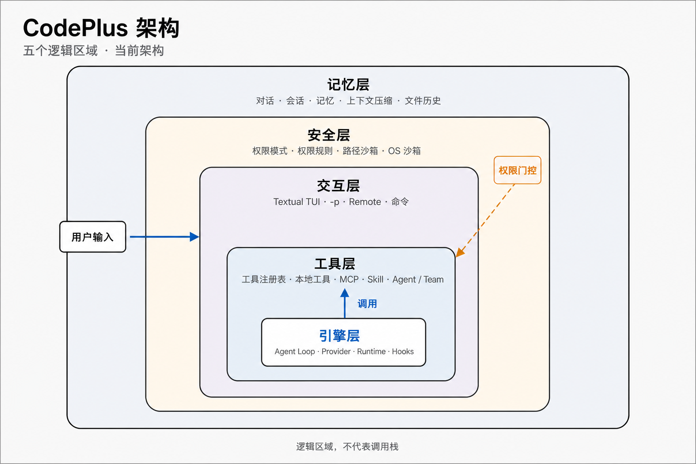

# CodePlus

[中文](README.md) | [English](README_EN.md)

> 工具是跨越技术鸿沟的“桥梁”，让我们走得更快、更远。但每座桥都有其设计边界。我们不只要成为熟练的“过桥者”，更要成为理解原理、懂得取舍、能够亲手造桥的“工程师”。

CodePlus 是一个终端 AI 编程工具。我想通过亲手构建它，慢慢弄清楚一件事：模型给出一个想法以后，还需要什么，才能把这件事可靠地做完。

---

## 为什么会有 CodePlus

最初吸引我的，是 AI 编程工具能沿着一个目标持续工作。给出需求，它开始读代码、修改文件、运行测试，原本需要自己来回切换的步骤被串了起来。我可以把注意力留给问题本身。

可当工作真正交出去以后，流畅的过程又会带来新的疑问：模型说“改好了”，它依据的是哪一次结果？中途停下来，文件已经改到哪里？对这些细节的好奇，让我想亲手做一遍。CodePlus 就从这里开始，把使用中的疑问变成可以亲手验证的设计。

---

## 从一次回答，到一段持续的工作

一次真实的代码修改，很少能在开始时就知道完整路径。

读过实现，才发现问题出在调用方；改完代码，测试又带回之前没有注意到的约束。很多信息不是事先想出来的，而是在执行过程中逐渐获得的。

所以 CodePlus 最核心的部分并不复杂：让模型先做当前能够判断的一步，通过 `Function Calling` 调用工具，再把真实结果放回上下文，由模型重新决定下一步。

```text
用户任务
   ↓
模型判断
   ↓
工具调用 ──→ 真实环境
   ↑            ↓
   └──── 执行结果
```

这就是 **[Agent Loop](codeplus/agent.py)**。

我选择 `ReAct` 式的循环，也是因为它允许最初的判断被后面的证据推翻。模型不需要一开始就想对所有事情，只需要根据结果不断修正下一步。

读文件、搜索代码、修改文件、运行命令，以及后来接入的 MCP 工具，都沿着同一条执行路径工作。核心循环只关心两件事：**模型准备做什么，执行以后发生了什么。**

但当 Agent 真正开始修改文件以后，问题就不只是“它会不会调用工具”了。

> **它以为自己做过的事情，和真实环境里发生的事情，是否一致。**

---

## 做了什么，必须和它以为自己做了什么一致

这个问题最容易在中断时暴露出来。

模型一次可能返回多个工具调用。第一个已经完成，第二个刚刚开始，用户这时按下停止。文件也许已经被修改，但执行结果还没有进入对话。

如果把“没有结果”理解成“没有执行”，下一次重试可能重复修改；如果直接假设执行成功，后面的判断又可能建立在不存在的状态上。

所以 CodePlus 不把这种情况伪装成成功或失败，而是明确保留 **[“结果未知”](codeplus/conversation_pairing.py)**。后续先检查真实状态，再决定是否继续。

`Function Calling` 的消息本身也有约束：工具调用与工具结果必须正确配对。一次中断、恢复或压缩，都可能破坏这种关系，让下一次请求直接失效。

> 这类能够确定的问题，我更愿意交给代码，而不是提醒模型“下次注意”。

还有一种错误不会让协议报错，却可能让整个任务走偏。

用户只是想补一个异常分支，Agent 却准备顺手重构整套接口。等代码全部写完再发现理解不同，修改、时间和 Token 都已经花出去了。

[Plan Mode](codeplus/commands/handlers/plan.py) 做的事情很简单：

> **把 review 从执行之后提前到执行之前。**

先理解现状，说明准备改什么、哪些行为需要保留，再真正开始修改。后面出现新的证据，计划仍然可以调整；但一开始就存在的方向分歧，没有必要等到最后才发现。

权限也是类似的问题。

最简单的办法，是每次修改文件、每次执行命令都询问用户。它足够安全，却会把一个连续任务切成几十次人工确认。

于是可以确定的判断继续向工程层下沉：只读操作直接通过，危险行为直接拒绝，路径边界和用户规则先完成判断，真正无法确定的部分再交给 [HITL](codeplus/permissions/checker.py)。

> **让模型处理不确定性，让代码守住确定的边界。**

但即使每一步都执行正确，任务持续得足够久以后，另一个限制还是会出现。

---

## 任务越长，最先不够用的是 Context

Coding Agent 会不断留下信息：读过的代码、测试结果、错误日志、工具调用、计划，以及用户后来补充的要求。

这些都是继续判断的依据，但上下文窗口不是无限的。

有时问题甚至来自一条命令。

一次搜索返回几万行内容，并不意味着后面的每一轮都需要重新看到这几万行；可直接截断，又可能恰好丢掉真正重要的部分。

CodePlus 对大结果先做的不是“删除”，而是 **“搬走”**：完整内容写入会话目录，上下文只保留预览和读取入口。多数时候预览已经足够；真的需要原文，再主动读取。

当正常轮次继续累积，落盘也无法解决全部问题时，才轮到真正有损的整理——[Compaction](codeplus/context/manager.py)。

较早的历史被整理成摘要，最近的消息继续保留原文，为后续工作腾出空间。

做到这里以后，我发现压缩最危险的地方并不是“少记住了一些细节”。

而是：

> **任务还在继续，原来的目标却可能已经悄悄变了。**

例如原始要求是：

> 修改接口，但保留旧行为。

如果压缩以后只剩下：

> 修改接口。

Agent 仍然会继续读代码、改文件、跑测试，整个流程看起来完全正常。

只是它已经不再做最初那件事了。

所以 `Context Engineering` 对我来说，慢慢变成了一个更具体的问题：

> **什么可以忘，什么应该搬走，什么即使经过压缩也必须继续影响后面的判断。**

而当我开始认真计算这些空间以后，又发现占用 Context 的并不只有工作历史。

**工具本身也在占。**

---

## 能力越多，留给任务的空间反而越少

[MCP](codeplus/mcp/manager.py) 让扩展工具变得很方便。

Agent 可以连接新的 Server，获得 GitHub、数据库或其他外部能力，而不需要把所有实现写进 CodePlus。

但工具越来越多以后，它们的名称、描述和参数 `Schema` 也会一起进入请求。

几十个工具即使这一轮一个都不会使用，也可能持续占据 Context。

于是出现了一个有些反直觉的结果：

> **能力增加了，真正留给当前任务的空间反而变少了。**

[ToolSearch](codeplus/tools/impl/tool_search.py) 和 [延迟加载](codeplus/mcp/loading_strategy.py) 就是从这里出现的。

模型一开始不需要看到所有工具的完整定义，只需要知道某种能力存在。真正需要时，再找到对应工具并取得 `Schema`。

工具很少时，直接加载最简单；工具规模真正开始侵占任务空间以后，再承担一次发现的成本，换回更多留给实际工作的 Context。

---

## 工具按需加载以后，Prompt Cache 还要保持稳定

延迟加载解决了工具 `Schema` 长期占用 Context 的问题，但它还带来了另一个独立的工程约束：

> **工具可以按需出现，请求前缀却不能跟着反复变化。**

最直接的实现，是 `ToolSearch` 找到一个新工具以后，把它的 `Schema` 加入下一轮工具数组。

功能可以正常工作，但工具数组一旦变化，后面的对话历史就可能失去原有的 `Prompt Cache` 前缀。

CodePlus 对这部分做了两条处理：

- **支持原生延迟加载的端点**：工具从会话开始就保持在稳定的工具数组中，由服务端决定当前是否向模型展开。
- **其他兼容端点**：不再把发现的 MCP 工具动态插回数组，而是保持固定的 `ToolSearch` 与 [mcp_call](codeplus/tools/mcp_call.py) 入口，由搜索结果提供 `Schema`，再通过统一入口完成实际调用。

这样：

> **工具仍然按需使用，但请求结构不需要随着每一次发现不断改变。**

延迟加载负责节省 Context，稳定的调用入口负责保住 `Prompt Cache`。

两者解决的是相邻，但不同的问题。

---

## 一个 Agent 不一定该承担整项工作

一个 Agent 已经可以持续工作更久，但有些任务的问题并不是 Context 还不够省，而是这些工作本来就没有必要全部放进同一份 Context。

一次修改如果同时横跨前端、后端和测试，所有探索过程都会进入同一份历史。

前端调查读过的几十个文件，对数据库修改可能没有价值；测试留下的大量日志，又会继续挤压其他工作的空间。

[Multi-Agent](codeplus/tools/agent_tool.py) 带来的第一个价值，因此并不是“多几个模型同时写代码”，而是：

> **让不同工作的上下文真正分开。**

一个 Agent 调查前端，一个 Agent 修改后端，各自只承担自己的代码、日志和尝试。任务边界足够清楚时，它们也可以并行推进。

但一个问题拆成多个 Agent 后，新的问题马上出现了：**协调。**

如果 Lead 派出 Worker 后只能一直等它返回，那么虽然多了一个 Agent，整体还是串行执行。

CodePlus 因而使用异步消息。任务先发进 [mailbox](codeplus/teams/mailbox.py)，Worker 在自己的 Loop 中处理，Lead 可以继续协调其他工作。

文件修改则通过 Git [worktree](codeplus/worktree/manager.py) 隔离。

不过文件不冲突，并不代表工作真的能够合并。

两个 Agent 完全可能在不同 `worktree` 中顺利完成修改，Git 合并也没有冲突，最后却因为对同一个接口作出了不同假设而一起出错。

所以 Multi-Agent 并不是越多越好。

> 如果任务边界清楚、依赖较少，它能同时减少上下文压力和串行等待；如果背景需要不断重复解释，每一步都必须互相确认，协调成本很快就会吃掉并行带来的收益。

任务做完以后，还有另一类问题会留下来。

**有些东西，下一次还会用到。**

---

## 会话结束以后，哪些东西应该留下

用户纠正过的习惯、一个项目长期遵守的约定，如果每次新会话都重新说明，合作很难真正积累下来。

[Memory](codeplus/memory/auto_memory.py) 解决的是这部分问题。

但记住什么，并不是唯一的问题。

还需要知道这些信息在什么范围内成立。

用户的表达偏好可以跨项目使用，一个仓库的技术约定却不应该进入另一个项目；“这次先兼容旧格式”也不能因为被记住，就变成以后一直不能修改旧格式。

所以我更愿意把 Memory 看成：

> **带作用域和生命周期的经验，而不是不断增长的一份笔记。**

Memory 解决的是过去形成的经验，下一次是否还应该继续生效。

但 Agent 下一次工作所需要的信息，并不都来自过去。

**有些答案，本来就在代码之外。**

---

## 当答案在代码之外

技术文档、产品资料、论文和研究笔记面对的是另一类问题。

这里需要的不是“模型还记不记得以前发生过什么”，而是：

> **面对当前问题，依据究竟在哪里。**

这也是下一步正在实现的 **[Agentic RAG（Work）模式](codeplus/tools/knowledge.py)** 想专门处理的事情。

它不会取代 Memory，也不负责代码检索。

三类信息会保持各自的边界：

| 信息 | CodePlus 中的处理方式 |
| --- | --- |
| **当前代码仓库** | [Glob](codeplus/tools/glob.py) / [Grep](codeplus/tools/grep.py) / [ReadFile](codeplus/tools/read_file.py) 直接读取真实工作区 |
| **跨会话经验** | [Memory](codeplus/memory/recall.py) |
| **外部非结构化资料** | [Agentic RAG（Work）模式](codeplus/knowledge/service.py) |

面对几百份文档时，有时连答案藏在哪一份资料、应该搜索什么关键词都不知道。语义检索可以先找到一个阅读起点，Agent 再带着当前问题回到原文，继续查找、补充证据，最后整理成回答或报告。

一次相似度检索不会直接成为最终结论。

我更希望 Work 模式解决的是：

> **报告写到哪里，依据就能跟到哪里。**

[来源、位置和版本](codeplus/knowledge/citations.py) 需要一起保留下来，让结论能够重新回到原文核对；没有找到足够依据的地方，也应该明确留下，而不是由模型凭过去的印象补齐。

这样，Memory、代码检索和 Agentic RAG 各自处理自己的信息边界，而不是为了“统一检索”被塞进同一套机制。

---

## 最后才发现，这些其实是同一个问题

回头看这些设计，我后来才意识到，它们并不是一组彼此独立的功能。

- **Agent Loop** 让模型能够持续行动。
- **工具** 把行动连接到真实环境。
- **权限** 决定哪些行动可以发生。
- **Context** 决定模型此刻能看到什么。
- **Memory** 决定哪些经验能够跨会话留下。
- **Multi-Agent** 又把不同工作的状态和上下文拆开。

它们处理的其实是同一个问题：

> **怎样让一个具有不确定性的模型，在一个确定的软件环境里持续工作。**

而 Agent 工程最麻烦的地方，也恰恰是这两种东西交织在一起。

模型反复读取同一个文件，可能不是 `ReadFile` 出错，而是一次 `Compaction` 丢掉了原来的修改计划。

工具选择错误，可能是模型判断错了，也可能是工具描述让两个能力看起来没有区别。

所以调试 Agent 时，只看最后一次报错往往不够。

还需要知道：

- 模型当时看到了什么；
- 模型做了什么；
- 工具真实返回了什么；
- 这些信息在前面的几十轮里如何被保留、压缩或丢失。

这也是我后来逐渐理解 **Harness Engineering** 的方式。

模型本身擅长的是判断：理解现在发生了什么，决定下一步应该做什么。

但一次判断要真正变成可靠的行动，周围还需要很多东西。

它需要工具去接触真实环境，需要 Context 知道当前发生过什么，需要权限划定哪些事情可以做，需要执行结果告诉它刚才那一步是否有效，也需要状态、[日志](codeplus/memory/session.py) 和验证机制，让一次失败不会直接变成无法追查的结果。

这些东西单独看分散在不同模块里，放在一起，其实构成了模型真正工作的环境。

> **Harness 做的，不是把模型变成一个确定的程序，而是把模型的不确定性放进一个可观察、可约束、可验证、也能够恢复的工程系统里。**

能由代码明确判断的事情，就不必反复交给模型猜；真正需要模型判断的地方，则尽量给它真实的信息和清楚的反馈。

这样，即使模型某一步判断错了，系统也不至于跟着一起失控：错误可以被拦住，结果可以被检查，状态可以被重新确认，问题也能沿着留下的过程继续追查。

**模型决定了 Agent 能想到什么。**

而 CodePlus 更想继续探索的，是怎样把模型的这些判断接到真实的软件环境里，让它不只是“想到下一步”，而是真的能够一步一步把事情做完。

---

## 接下来想做的事

接下来，继续扩展 **Agentic RAG（Work）模式**：补充扫描件 OCR 与复杂版面解析，将 BM25 + 向量混合检索接入日常问答，并增加 Rerank 精排，让更多类型的资料能够参与查证与引用报告生成。

---

## 目前能做什么

目前的能力可以概括为：

| 方向 | 关键词 |
| --- | --- |
| **交互** | TUI · Remote |
| **执行** | Agent Loop · 文件读写 · 代码搜索 · 命令执行 |
| **协作** | Sub-agent · Team Mailbox · 共享任务板 · 后台任务 |
| **上下文** | Session 恢复 · Memory · Compaction · 文件回退 |
| **知识库（扩展中）** | Agentic RAG（Work）模式 · 文档导入 · 引用问答 · 报告生成 |
| **扩展** | 多模型协议 · Skill · MCP · Hooks |
| **执行控制** | 权限规则 · 路径边界 · 可选沙箱 · Git worktree |

Agentic RAG（Work）模式已接入 TUI、CLI 和 Remote，当前使用本地 Qwen Embedding + Milvus 向量检索，回答由配置的模型生成。

---

## 架构



回头看，前面的问题逐渐落在了不同的职责上：Agent Loop 组织行动，权限约束执行，Session、Memory 与 Context 保留不同生命周期的信息，知识库补充外部证据。图中展示这些逻辑区域；知识库的接入与边界见 [架构说明](docs/knowledge-architecture.md)。

---

## 快速开始

### 安装与配置

需要 Python 3.11+、uv 和可用的模型 API。在仓库目录安装依赖，首次使用时复制配置；已有配置可跳过复制。

```powershell
uv sync --locked
Copy-Item .codeplus/config.yaml.example .codeplus/config.yaml
```

Linux/macOS 将 `Copy-Item` 换成 `cp`。编辑 `.codeplus/config.yaml` 中的 `providers`，填写协议、地址、模型与 API Key；不使用 MCP 时将 `mcp_servers` 设为 `[]`。

### 启动与运行

```powershell
uv run codeplus
```

进入终端后直接描述任务。`/help` 查看命令，`/session list` 和 `/session resume <id>` 恢复历史，`/tasks` 查看后台子 Agent。

也可以单次执行、输出 NDJSON，或启动浏览器入口：

```powershell
uv run codeplus -p "检查当前项目并总结风险"
uv run codeplus -p "检查当前项目" --output-format stream-json
uv run codeplus --remote
```

Remote 默认监听 `0.0.0.0:18888`，本机访问 `http://localhost:18888`。TUI 按权限规则处理需要确认的修改与命令；普通 `-p` 会自动同意权限询问。

### 可选：Agentic RAG（Work）模式

本地知识库能力仍在扩展中，通过 `/knowledge` 命令启用和管理。

按 [部署说明](docs/knowledge-setup.md#最短使用流程) 在已有配置中保留 `providers`，启用 `knowledge.enabled`。项目受管本地部署另设 `knowledge.managed_local: true`，首次进入知识库会自动准备服务与模型；外部 Milvus 保持 `false`，只连接配置的地址。

```powershell
uv sync --locked --extra knowledge
uv run --extra knowledge codeplus
```

后续运行也保留 `--extra knowledge`。首次准备可能下载本地嵌入模型；失败后用 `/knowledge prepare` 重试。回答仍使用已配置的模型服务。

#### 导入与使用

```text
/knowledge create "个人资料"
/knowledge import "C:\资料目录"
根据资料比较各方案，附原文引用，并将报告保存为 comparison.md。
/knowledge open K:<kb_id>:<chunk_id>
```

`create` 自动选中知识库，下次用 `/knowledge use <kb_id>`。同一路径再次导入即更新；`/knowledge sources` 查看文档，`/knowledge status` 查看状态，`/knowledge off` 退出资料问答。写报告沿用原文件权限。

#### 引用与非交互调用

TUI 与 Remote 回答中的 `[1]`、`[2]` 可点击查看文件名、位置、引用原文及版本状态；TUI 也可 Tab 聚焦回答后按 Enter 打开、Esc 关闭。恢复会话仍可查看切库或退出知识模式前的引用，CLI 与报告保留完整追溯 ID。

非交互问答使用 `uv run --extra knowledge codeplus -p "根据资料回答并引用来源" --knowledge <kb_id>`。知识库非交互模式拒绝需要询问的操作，写报告可显式加 `--mode acceptEdits`。Remote 使用同一套命令，导入路径属于服务端。删除、恢复、格式限制和检索实验见 [完整说明](docs/knowledge-setup.md)。

---

## 开发

可以沿一次工具调用阅读 [Agent Loop](codeplus/agent.py) 与 [tools](codeplus/tools)，再追踪 [agents](codeplus/agents) / [teams](codeplus/teams) 的上下文与消息流。[memory](codeplus/memory)、[context](codeplus/context) 和 [knowledge](codeplus/knowledge) 则分别处理长期记忆、当前推理窗口与外部证据。

```powershell
uv sync --locked --dev
uv run pytest
```

知识库的真实集成验证还需要可选依赖、Milvus 和本地模型，环境与验收记录见 [知识库说明](docs/knowledge-setup.md)。

---

## 写在最后

> 回到最初的比喻，我想，“造桥”的过程大概就是这样：从一个看起来能用的功能出发，沿着真实问题继续追问，逐渐理解它为什么有效，又会在哪里失效。

CodePlus 会记录这段过程，也继续接受真实工作的检验。
