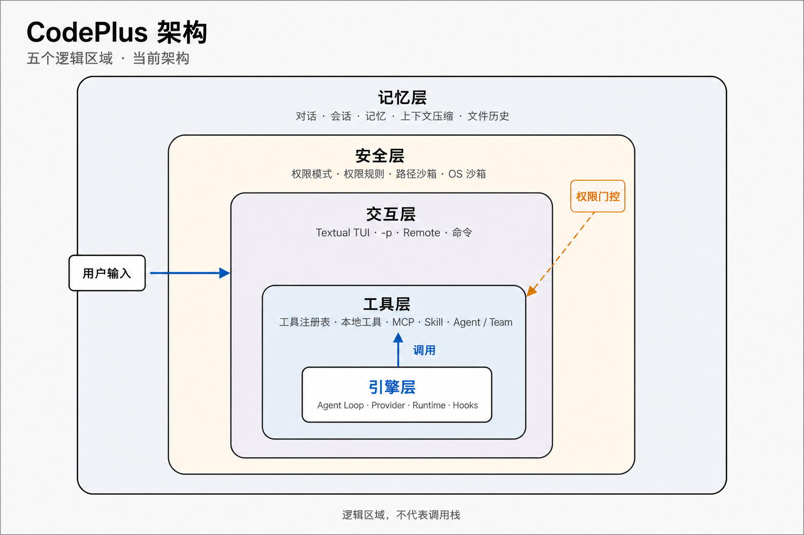

# CodePlus

[中文](README.md) | [English](README_EN.md)

> 工具是跨越技术鸿沟的“桥梁”，让我们走得更快、更远。但每座桥都有其设计边界。我们不只要成为熟练的“过桥者”，更要成为理解原理、懂得取舍、能够亲手造桥的“工程师”。

CodePlus 是一个终端 AI 编程工具，也是我探索 Agent Runtime 的实践：让模型的推理进入真实环境，并为工具调用、上下文和协作建立可以检查的执行规则。

## 为什么会有 CodePlus

最初吸引我的，是 AI 编程工具能够沿着一个目标持续工作：读代码、调用工具、观察结果，再决定下一步。顺着这条路径往下看，我开始在意那些藏在流畅交互背后的问题。

模型认为修改已经完成，工作区是否真的处于它理解的状态？一次工具调用被中断，重试会不会重复产生副作用？上下文压缩之后，留下的摘要是否仍足以支撑原来的决策？这些问题把我的注意力带到了模型与环境之间的运行机制上。

模型每一轮都可能给出不同的行动方案，而文件、权限和执行结果需要明确的事实依据。我想通过 CodePlus 探索这两者如何衔接：让模型保有探索空间，也让系统能够追踪它依据什么行动、改变了什么，以及哪里仍然不确定。

## Agent Loop 如何守住执行的因果关系

接入 **Tool Calling** 之后，模型输出开始产生真实的副作用。流式响应中的工具名、参数片段和完整调用，处于不同的生命周期阶段。CodePlus 的 [Agent Loop](codeplus/agent.py) 会收齐一轮模型响应，再执行工具，避免半条响应就触发工作区变更。

并发随之带来更细的问题。模型在同一轮提出“修改文件，再读取文件”，后一次读取依赖前一次写入；如果把所有调用一起交给 `asyncio.gather`，返回的观察可能还是旧内容。当前实现只合并相邻、声明为可安全并发的只读调用，让写入、命令和权限等待保持原有顺序。优化延迟时，我需要先守住这些动作之间的因果关系。

中断则会留下更难处理的状态：文件可能已经写入，结果却没来得及进入上下文。此时需要区分“明确拒绝”“执行失败”和“结果未知”。当前的 [tool-use / tool-result 配对修复](codeplus/conversation_pairing.py) 会在请求前补充中断标记，保留“可能已产生副作用”的事实，并保持原始历史不变。至于子进程是否仍在运行、动作能否安全重试，还需要在具体执行边界上判断。

这也改变了我对权限的理解。**Human-in-the-loop（HITL）** 要把授权、等待和继续执行接入同一条工具调用路径；子 Agent、MCP 与不同交互入口还需要各自核对权限如何传递。模型提出行动，运行时决定如何执行，用户则能够在关键节点暂停、纠偏或接管。

## Context Engineering：压缩之后，Agent 还知道什么

长任务把 **Context Engineering** 变成了一个决策问题。模型下一轮能够直接利用的任务信息，取决于实际送入窗口的内容；一条约束即使还在日志里，被压缩掉以后也未必继续影响它。摘要是有损表示，遗漏的前提、被淡化的失败尝试，都可能改变后续推理的方向。

当前 [上下文管理](codeplus/context/manager.py) 会摘要较早的历史、保留近期原文，并避免拆开工具调用与结果；压缩边界也写入 Session，供恢复时重放。Token 预算结合 API 用量与新增消息估算，历史重建后重新建立用量锚点。这些处理分别照顾协议完整性、状态恢复和窗口预算；摘要是否保住了完成任务所需的约束，仍需要行为验证。

工具定义本身也占用上下文。接入更多 MCP 工具后，完整 **Schema** 的成本、工具发现的额外轮次，以及 **Prompt Caching** 对请求前缀稳定性的要求，会一起影响设计。CodePlus 的 [MCP 加载策略](codeplus/mcp/loading_strategy.py) 按工具规模与端点选择全量加载、原生延迟加载或统一调用入口。我关心的是：省下的输入成本，是否值得增加一次检索，以及模型还能否准确找到并调用所需工具。

## 多 Agent 协作，难在共享什么、隔离什么

把一个任务交给多个 Agent，会同时引入上下文隔离与信息同步。继承父会话可以减少交接损耗，也可能把尚未验证的假设一起带给审查者；全新上下文有利于重新判断，却需要补足依据。我希望任务拆分能够明确目标、输入证据和验收条件，让分工真正形成相互校验。

工作区还有自己的并发问题。独立上下文中的两个 Agent，仍可能修改同一个文件。Git worktree 能隔离修改，但结果合并仍可能出现语义冲突：补丁能够合上，各自成立的假设却未必兼容。当前文件工具会检查读后文件是否发生变化；这种基于修改时间的陈旧性检查，也有检查与实际写入之间的竞争窗口。

目前 CodePlus 提供子 Agent、Team Mailbox 和共享任务板，用于会话内分工。继续往长期协作走，就要分别处理消息送达、任务认领、实际执行和结果确认。一次发送成功之后，接收方是否开始了工作、是否完成了副作用、结果是否被接纳，都需要各自的状态依据。这也是独立持久任务仍被保留为后续方向的原因。

## RAG：一份回答背后的证据能否保持一致

接入 **RAG（检索增强生成）** 后，我开始关心证据从哪里来、又属于哪个版本。一次 Chunking 会改变检索单元，Embedding 决定相似性空间，而引用还要能回到原文位置。CodePlus 分别保存原件、内容哈希、文档代次（generation）和来源位置，让检索结果具有可追溯的 **Provenance（来源记录）**。会话记忆与文档证据也分别管理，避免把上一次回答当成下一次回答的依据。

更新文档时，工程问题落在 SQLite 元数据与 Milvus 向量之间：两个存储无法靠一次本地事务共同提交。当前 [知识库服务](codeplus/knowledge/service.py) 先登记待完成操作，再更新和校验向量，最后完成元数据提交；失败时阻止继续检索，并保留材料供显式重试。这是一条可恢复的提交路径，它的价值在于把部分失败显式保留下来。

新查询只使用当前有效代次，历史引用仍能回查旧原文。回答过程中还会检查知识库 revision，发现资料变化就要求重新生成；这提供了变更检测，跨多次查询的一致性快照仍有更高要求。引用校验目前能确认“来源存在且本轮已提供”，至于原文是否支持结论，则是 **Grounding（事实依据）** 的另一层验证。

## 怎样知道一次改进真的有效

这些取舍最终都要落到 **Evaluation（评测）** 上。我会先问测试的判定依据是否独立于 Agent 自己的叙述：执行顺序要观察真实读写，中断恢复要核对实际状态，压缩效果要看关键约束还能否影响后续行为。失败分支尤其重要，因为自动化系统常常需要带着部分完成的工作继续前进。

知识库的 [冻结检索实验](codeplus/knowledge/evaluate.py) 就区分了两种指标：**ANN Recall** 衡量近似索引与精确检索的邻居重合度，**证据召回率** 衡量结果是否覆盖标注的原文依据。前者很高时，后者仍可能不足。实验会保留失败样本的分母，并把空结果与请求失败分开统计；回答是否忠于证据，还需要单独验证。这样才能知道一项优化究竟改善了索引、检索，还是最终回答。

## 目前能做什么

当前仓库已经串起模型推理、工具执行、上下文管理和资料检索；下面只列已有入口与能力。

| 方向 | 当前能力 |
| --- | --- |
| 执行 | Agent Loop、文件读写与搜索、命令执行；支持 TUI、非交互 CLI、NDJSON 事件与浏览器 Remote |
| 协作 | 会话内子 Agent、Team 消息与共享任务板；可查看和停止后台任务 |
| 上下文 | Session 持久化与恢复、自动 Memory、Context Compaction、文件历史与回退 |
| 知识库 | 导入 Markdown、文本型 PDF、DOCX，基于资料问答、保存引用报告、回查原文；支持更新、移除与失败重试 |
| 扩展 | Anthropic、OpenAI、OpenAI 兼容协议，以及 Skill、MCP、Hooks |
| 执行控制 | 权限规则、路径边界、可选系统沙箱与 Git worktree 隔离 |

知识库已接入 TUI、非交互 CLI 和 Remote。检索使用本地 Qwen Embedding 与 Milvus，回答使用配置的模型服务。日常检索为向量检索；BM25/RRF 属于独立实验，OCR 和精排尚未实现。

## 接下来想解决的问题

下一步想探索的是独立任务的持久执行（Durable Execution）：让任务在进程退出、消息重发或人工介入之后，仍能根据持久化状态继续工作。这里需要明确单一执行者、消息确认与幂等边界；恢复会话时，也必须先核对已发生的副作用，再决定哪些动作可以重放。

这些仍是设计问题与后续目标。当前仓库尚未提供独立 Runtime Task 或 `codeplus task ...` 入口，已有 Session 恢复与 Team 通信各自解决了其中一部分问题。

## 架构



图中是职责划分。Agent Loop 组织模型与工具，权限模块约束执行，Session、Memory 与 Context 管理不同生命周期的信息；知识库通过检索工具和本轮证据上下文接入。各层需要传递可核对的结果与失败状态，详见 [知识库架构](docs/knowledge-architecture.md)。

## 快速开始

需要 Python 3.11+、[uv](https://docs.astral.sh/uv/) 和可用的模型 API。在仓库目录安装依赖，首次使用时复制配置；已有配置可跳过复制。

```powershell
uv sync --locked
Copy-Item .codeplus/config.yaml.example .codeplus/config.yaml
```

Linux/macOS 将 `Copy-Item` 换成 `cp`。编辑 `.codeplus/config.yaml` 中的 `providers`，填写协议、地址、模型与 API Key；不使用 MCP 时将 `mcp_servers` 设为 `[]`。

```powershell
uv run codeplus
```

进入终端后直接描述任务。`/help` 查看命令，`/session list` 和 `/session resume <id>` 恢复历史，`/tasks` 查看后台子 Agent。

也可以单次执行、输出 NDJSON，或启动浏览器入口：

```powershell
uv run codeplus -p "检查当前项目并总结风险"
uv run codeplus -p "检查当前项目" --output-format stream-json
uv run codeplus --remote
```

Remote 默认监听 `0.0.0.0:18888`，本机访问 `http://localhost:18888`。TUI 按权限规则处理需要确认的修改与命令；普通 `-p` 会自动同意权限询问。

### 可选：本地知识库

按 [部署说明](docs/knowledge-setup.md#最短使用流程) 在已有配置中保留 `providers`，启用 `knowledge.enabled`。项目受管本地部署另设 `knowledge.managed_local: true`，首次进入知识库会自动准备服务与模型；外部 Milvus 保持 `false`，只连接配置的地址。

```powershell
uv sync --locked --extra knowledge
uv run --extra knowledge codeplus
```

后续运行也保留 `--extra knowledge`。首次准备可能下载本地嵌入模型；失败后用 `/knowledge prepare` 重试。回答仍使用已配置的模型服务。

```text
/knowledge create "个人资料"
/knowledge import "C:\资料目录"
根据资料比较各方案，附原文引用，并将报告保存为 comparison.md。
/knowledge open K:<kb_id>:<chunk_id>
```

`create` 自动选中知识库，下次用 `/knowledge use <kb_id>`。同一路径再次导入即更新；`/knowledge sources` 查看文档，`/knowledge status` 查看状态，`/knowledge off` 退出资料问答。写报告沿用原文件权限。

TUI 与 Remote 回答中的 `[1]`、`[2]` 可点击查看文件名、位置、引用原文及版本状态；TUI 也可 Tab 聚焦回答后按 Enter 打开、Esc 关闭。恢复会话仍可查看切库或退出知识模式前的引用，CLI 与报告保留完整追溯 ID。

非交互问答使用 `uv run --extra knowledge codeplus -p "根据资料回答并引用来源" --knowledge <kb_id>`。知识库非交互模式拒绝需要询问的操作，写报告可显式加 `--mode acceptEdits`。Remote 使用同一套命令，导入路径属于服务端。删除、恢复、格式限制和检索实验见 [完整说明](docs/knowledge-setup.md)。

## 开发

可以沿一次工具调用阅读 [Agent Loop](codeplus/agent.py) 与 [tools](codeplus/tools)，再追踪 [agents](codeplus/agents) / [teams](codeplus/teams) 的上下文与消息流。[memory](codeplus/memory)、[context](codeplus/context) 和 [knowledge](codeplus/knowledge) 则分别处理长期记忆、当前推理窗口与外部证据。

```powershell
uv sync --locked --dev
uv run pytest
```

知识库的真实集成验证还需要可选依赖、Milvus 和本地模型，环境与验收记录见 [知识库说明](docs/knowledge-setup.md)。

## 写在最后

每增加一层自动化，我都想继续追问：一次成功依赖哪些前提，一次失败留下什么状态，恢复之后还能否沿着真实证据继续工作。CodePlus 会记录这些问题，也让每一次实现接受真实任务的检验。
