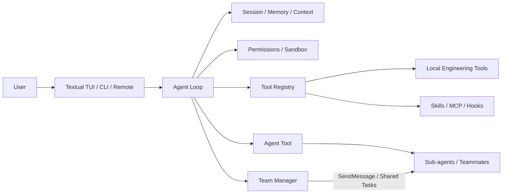

# CodePlus

[中文](README.md) | [English](README_EN.md)

> Exploring how tasks can communicate directly, hand work off, and collaborate over time, while providing a genuinely usable terminal AI coding tool.

CodePlus is not intended to be a direct reproduction of Codex. Through this project, I want to keep exploring new forms of Agent collaboration, learn from proven ideas in existing tools, and gradually turn my understanding into a technical implementation that can be shared and used.

## Why CodePlus Exists

I have seen many people share their Agent workflows, and many of those workflows use multiple sub-agents. Yet workflows that truly take advantage of direct task-to-task communication still seem uncommon, or at least I have not encountered many of them.

Codex does not prominently advertise this capability, or at least I did not see it mentioned when I first started using it. I discovered it by accident: I asked one task to prepare a prompt for another task and expected it to give me text that I could copy. Instead, it sent the message directly to the target task. At the time, I did not even know tasks could communicate this way.

I later began experimenting with it in several scenarios:

- **Task handoff**: after Task A finishes, create a new task with fresh context and send it a structured handoff directly.
- **Model specialization**: create tasks with different models or reasoning capabilities, then assign each task work suited to its ability and cost.
- **Progress monitoring**: ask one task to summarize another task's progress in plain language and determine whether human steering is needed; when it is, the monitoring task can send corrective instructions directly to the implementation task.
- **Multi-level orchestration**: let an orchestrator task create several independent tasks that proactively report completion or blockers; each task can still use internal sub-agents for smaller units of work.
- **Highly visible parallel collaboration**: turn execution that would otherwise remain hidden inside one Agent into independent tasks that users can observe, open, steer, stop, and reconnect to.

That is not the full extent of it. Tasks can archive conversations that are no longer needed, be created in advance and wait for a trigger, wake up after becoming idle, or receive the same updated instruction together. A task can even confirm that it understands its assignment and then wait until another task sends a simple "start" message when the required condition is met.

CodePlus also treats this way of working as a long-term direction: tasks should no longer be isolated, one-off conversations, but work units that can communicate, hand off work, wait, recover, and collaborate over time.

## Two Forms of Parallel Collaboration

User-visible tasks and internal sub-agents solve different problems and should not be treated as the same thing.

```text
User-visible tasks                     Inside the current task

Task A       Task B       Task C        Current task
  |            |            |             +-- Sub-agent
  +---- messages, waits, handoffs ----+       +-- Sub-agent

Independent windows and context,       Focused research, review,
with reattachment support               and bounded parallel work
```

User-visible tasks are suited to long-running work, cross-task communication, and human intervention. Internal sub-agents are better suited to code review, focused research, and parallel changes within the current task. CodePlus keeps the distinction explicit. The current version first implements Agent and Team collaboration inside a task; independent user-visible tasks with long-lived recovery remain a next-stage capability.

## The Tool System I Observed in Codex

The names below come from the tool environment I observed while using Codex Desktop. They are included to explain the inspiration and capability mapping behind CodePlus. They do not represent a long-term compatibility commitment from OpenAI for these internal tool names or behaviors, and the available capabilities may differ by version, account, or runtime environment.

### User-Visible Task and Thread Coordination

| Tool | Purpose |
| --- | --- |
| `codex_app__create_thread` | Create a new user-visible Codex task with an optional project and working directory |
| `codex_app__send_message_to_thread` | Send follow-up instructions, steering, or reporting requests to an existing task |
| `codex_app__wait_threads` | Wait for one or more tasks to finish, request input, or enter a state requiring attention; up to 8 tasks at once |
| `codex_app__read_thread` | Read task status, Turn summaries, final responses, and tool output |
| `codex_app__list_threads` | List user-visible tasks |
| `codex_app__fork_thread` | Create a branch task from the completed context of an existing task |
| `codex_app__handoff_thread` | Hand a task off to another task or execution environment |
| `codex_app__get_handoff_status` | Query the state of an asynchronous task handoff |
| `codex_app__set_thread_archived` | Archive or restore a task |
| `codex_app__set_thread_pinned` | Pin or unpin a task |
| `codex_app__set_thread_title` | Change a task title |
| `codex_app__navigate_to_codex_page` | Open a specific task in the Codex application |
| `codex_app__read_thread_terminal` | Read terminal output associated with the current desktop task |
| `codex_app__list_projects` | List local projects available for task creation, including their paths and Git state |

A typical flow looks like this:

```text
create_thread
    -> send_message_to_thread
    -> wait_threads
    -> read_thread
```

There are three important distinctions:

1. `create_thread` creates an independent task that users can see and open from the sidebar.
2. `send_message_to_thread` sends follow-up information across tasks instead of copying a prompt back into the current conversation.
3. `wait_threads` waits for state events, so the caller does not need to repeatedly read another task's full history.

After a task finishes, it can also proactively use `send_message_to_thread` to report its result or blocker to the source task.

### Internal Sub-Agent Coordination

| Tool | Purpose |
| --- | --- |
| `collaboration.spawn_agent` | Create a sub-agent inside the current task |
| `collaboration.followup_task` | Assign follow-up work to an existing sub-agent and wake it up |
| `collaboration.send_message` | Add information for a running sub-agent without necessarily starting another turn |
| `collaboration.wait_agent` | Wait for a sub-agent to finish or produce a message |
| `collaboration.interrupt_agent` | Interrupt a sub-agent's current work |
| `collaboration.list_agents` | Inspect the current Agent tree and runtime state |

Internal sub-agents usually do not appear as peer tasks in the user's task list. They are suited to bounded, parallel units of work. User-visible tasks behave more like independent work threads: each has its own lifecycle and can be opened, waited on, and sent additional messages independently.

### Local Files and Commands

| Tool | Purpose |
| --- | --- |
| `shell_command` | Run PowerShell commands to read files, build the project, and execute tests |
| `apply_patch` | Apply precise patches to files |
| `view_image` | Inspect local images and visual output |
| `codex_app__load_workspace_dependencies` | Discover Node.js, Python, document, and media dependencies provided by the desktop environment |

Together, they form the most common engineering loop:

```text
Read code -> Modify code -> Build or test -> Inspect real output
```

### Planning, Goals, and MCP Resources

| Tool | Purpose |
| --- | --- |
| `update_plan` | Update the current task plan and step status |
| `create_goal` | Create an explicit long-term goal |
| `get_goal` | Query the current goal and execution state |
| `update_goal` | Mark a goal as complete or blocked |
| `list_mcp_resources` | List resources exposed by MCP services |
| `read_mcp_resource` | Read a specific MCP resource |
| `list_mcp_resource_templates` | List parameterized MCP resource templates |

These tools manage goals, plans, and context. They do not replace tools that actually execute code.

### Automation and Task Management

| Tool | Purpose |
| --- | --- |
| `codex_app__automation_update` | Create, inspect, update, or delete scheduled tasks, reminders, monitors, and future wakeups |
| `codex_app__set_thread_archived` | Archive completed tasks while preserving their history and reducing list clutter |
| `codex_app__set_thread_pinned` | Pin important tasks that require ongoing attention |
| `codex_app__set_thread_title` | Give long-running tasks stable, recognizable names |
| `codex_app__navigate_to_codex_page` | Navigate to a task that needs attention in the desktop application |

## What CodePlus Already Implements

The current CodePlus repository provides runnable terminal entry points, real model calls, local engineering tools, permission controls, internal Agent/Team collaboration, Skills, MCP, context management, and worktree support. This section only describes capabilities that map to code and tests in the current repository.

### Runnable Entry Points

- Interactive Textual TUI for ongoing conversations, streamed output, tool calls, and permission requests.
- Non-interactive execution through `-p`, printing the final response.
- Structured NDJSON events through `stream-json` in non-interactive mode.
- A Remote entry point that starts a WebSocket service and browser UI on `0.0.0.0:18888` by default.

```powershell
uv run codeplus
uv run codeplus -p "inspect this project and summarize its risks"
uv run codeplus -p "run the tests" --output-format stream-json
uv run codeplus --remote
```

### Internal Agent and Team Collaboration

- `Agent` provides bounded sub-agent work inside the current session for research, implementation, review, and verification.
- `TeamCreate`, `TeamDelete`, `SendMessage`, and `TaskStop` manage internal teams, teammate communication, and stop requests.
- `TaskCreate`, `TaskGet`, `TaskList`, and `TaskUpdate` provide a shared internal team task board. These Tasks are internal work items, not independent user-visible Runtime Tasks.
- Teams can use in-process, tmux, or iTerm2 backends according to the environment, with in-process execution where independent panes are not appropriate.
- Optional coordinator mode narrows the Lead's tools so it can focus on decomposition, delegation, follow-up, and synthesis.

### Engineering Tools, Permissions, and Safety Boundaries

- Local tools: `ReadFile`, `WriteFile`, `EditFile`, `Bash`, `Glob`, and `Grep`.
- Interaction and workspace tools: `AskUserQuestion`, `ExitPlanMode`, `EnterWorktree`, and `ExitWorktree`.
- Permission modes: `default`, `acceptEdits`, `plan`, and `bypassPermissions`.
- Permission rules can be loaded from user, project, and local override layers, then combined with path boundaries, dangerous-command detection, and an optional OS sandbox.
- Git projects can create isolated worktrees with change inspection, cleanup, and session integration.

### Models, Extensions, and Context

- Providers: Anthropic, OpenAI, and OpenAI-compatible protocols. Actual model, tool, and streaming capabilities depend on the configured endpoint.
- MCP: stdio and Streamable HTTP services, with eager or deferred discovery based on tool volume.
- Skills: local loading, installation, and runtime execution.
- Context: Session history, automatic Memory, project instructions, context compaction, file history, and rewind.
- Extensions: lifecycle Hooks, tool search, and non-interactive `stream-json` output.

## Next Stage: User-Visible Runtime Tasks

Persistent, user-visible Runtime Tasks that can be reattached across windows are the next-stage replacement direction for CodePlus. The contract below is retained as a product target; it does not mean that the current repository already provides these entry points. These capabilities will not move into the implemented section until real persistence, process coordination, and end-to-end acceptance are complete.

### Target Tool Contract

| Target Tool | Intended Behavior |
| --- | --- |
| `TaskSpawn` | Create an independent, user-visible, persistent Runtime Task with an appropriate window mode |
| `TaskSend` | Reliably send messages to an existing task with idempotency and FIFO queuing |
| `TaskWait` | Wait on one or more tasks using event cursors without repeatedly reading full history |
| `TaskRead` | Read tasks, messages, Turns, events, and pending interactions |
| `TaskList` | List tasks visible to the current project and states requiring user attention |
| `TaskFork` | Create a task from the source task's completed, persisted history |
| `TaskInterrupt` | Request interruption and converge persisted state with the real worker |

The target CLI shape is shown below. The current version will fail if these `codeplus task ...` commands are run:

```text
codeplus task create --prompt "optional initial prompt"
codeplus task open
codeplus task respond
codeplus task send
codeplus task wait
codeplus task read
codeplus task list
codeplus task fork
codeplus task interrupt
codeplus task resume
codeplus task delete
```

### Full Chain That Must Be Rebuilt

- Every user-visible task has independent context and a complete interactive window, with reattachment after a client closes.
- Tasks, messages, events, Turns, and interaction requests use authoritative persistent state; clients do not keep a second copy of business state.
- New messages remain FIFO-queued while permission or AskUser interactions are pending, and the pending interaction stays actionable.
- A task has only one Session writer, with leases, heartbeats, CAS, and idempotency keys preventing duplicate execution.
- Git projects can choose a shared directory or isolated worktree for a task, and that choice follows the task lifecycle.

The current internal Agent/Team capabilities do not stand in for this Runtime Task chain. A future implementation must cover real entry points, persistence, recovery, permissions, state transitions, and failure branches together.

## Capabilities Still Being Explored

- Pinning, soft archiving, and independent title management for user-visible tasks.
- Asynchronous handoff and status queries across projects, worktrees, or execution environments.
- Codex Desktop project discovery and desktop terminal buffer access.
- Scheduled tasks, reminders, periodic monitoring, and condition-triggered wakeups.
- Letting the main task automatically select a configured Provider, model, and API Key for each task based on the type of work.
- Letting the main task allocate an overall budget, assign reasoning effort and cost shares according to task difficulty, and continuously detect and correct execution drift.
- Detecting when task context has drifted from the original goal, then requesting clarification, replanning, or handing off without unnecessarily interrupting normal execution.

## Architecture

The diagram below shows the main runtime relationships that exist in the current repository. User-visible Runtime Tasks are not yet part of this architecture.



`Agent` is the current execution loop, while the `Tool Registry` provides local tools and extension capabilities. Permissions, context, and session state are managed by their respective modules. Internal sub-agents and Team teammates are collaboration units inside the current session, not user-visible Runtime Tasks with independent lifecycles.

## Quick Start

### Requirements

- Python 3.11 or later
- [uv](https://docs.astral.sh/uv/)
- At least one available model Provider and API Key

### Install Dependencies

```powershell
uv sync --dev
```

### Configure a Provider

Windows PowerShell:

```powershell
Copy-Item .codeplus\config.yaml.example .codeplus\config.yaml
```

Linux or macOS:

```bash
cp .codeplus/config.yaml.example .codeplus/config.yaml
```

Edit `.codeplus/config.yaml` and enter your Provider, model, and API Key. This file is intended to remain a local configuration file.

### Start CodePlus

Launch the interactive TUI:

```powershell
uv run codeplus
```

## Development and Verification

Main directories:

```text
codeplus/
  agents/          Sub-agent loading, execution, and tracing
  teams/           Internal Teams, mailboxes, and shared work items
  tools/           Local, Agent, Team, Skill, and MCP tools
  commands/        TUI slash commands and completion
  permissions/     Permission modes, rules, and path boundaries
  sandbox/         Optional OS sandbox
  mcp/             MCP clients, manager, and tool wrappers
  skills/          Skill loading, installation, and execution
  memory/          Sessions, automatic memory, and context recall
  context/         Context-window management
  hooks/           Lifecycle Hooks
  filehistory/     File history and recovery
  worktree/        Git worktree lifecycle
tests/             Unit, persistence, TUI, and integration tests
```

Run the complete test suite:

```powershell
uv run pytest
```

## Project Positioning

CodePlus is an independent project and is not an official OpenAI or Codex component.

It aims to answer a question that is still evolving rapidly: when Agents are no longer limited to one-off answers, but instead have independent tasks, persistent context, direct communication, and long-term collaboration, how should software development tools organize those Agents more effectively and efficiently while still keeping their work visible, controllable, and subject to user decisions at critical points?

This question is worth exploring over time, and it is worth turning into a complete tool that can be used for the long term.
