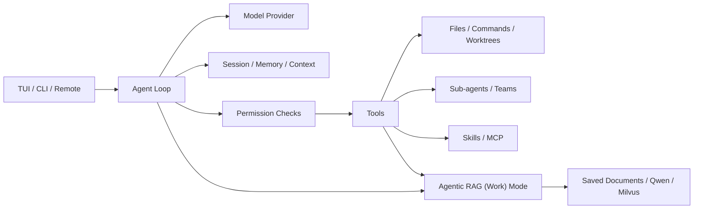

# CodePlus

[中文](README.md) | [English](README_EN.md)

> Tools are bridges across technical gaps, helping us go faster and further. But every bridge has design limits. We should become not only skilled at crossing bridges, but engineers who understand the principles, weigh the tradeoffs, and can build bridges themselves.

CodePlus is a terminal AI coding tool. By building it, I want to gradually understand what it takes to turn an idea from a model into work that is reliably completed.

---

## Why CodePlus Exists

What first drew me to AI coding tools was their ability to keep working toward a goal. Given a requirement, they read code, edit files, and run tests. Steps that used to require constant switching become connected, leaving me more attention for the problem itself.

Once the work is handed over, though, that smooth experience raises questions of its own. When the model says “fixed,” which result is it relying on? If work stops midway, what has already changed? Curiosity about these details made me want to build one myself. CodePlus begins there, turning questions from everyday use into designs I can put to the test.

---

## From One Answer to Sustained Work

A real code change rarely begins with the full path known.

Reading the implementation reveals that the problem lies in a caller; testing an edit brings back constraints missed earlier. Much of the information comes gradually through execution, rather than being worked out in advance.

The core of CodePlus is therefore straightforward: let the model take a step it can judge now, call tools through `Function Calling`, then return the actual results to context so the model can decide what to do next.

```text
User task
    ↓
Model judgment
    ↓
Tool call ───→ Real environment
    ↑                ↓
    └──── Execution result
```

This is the **[Agent Loop](codeplus/agent.py)**.

I chose a `ReAct`-style loop because it allows later evidence to overturn the initial judgment. The model does not need to get everything right at the start; it needs to keep revising the next step based on results.

Reading files, searching code, editing files, running commands, and the MCP tools added later all follow the [same execution path](codeplus/agent.py). The core loop cares about two things: **what the model intends to do, and what happened after execution.**

Once the Agent starts changing files, though, the question goes beyond whether it can call tools.

> **Does what it believes it has done match what actually happened in the environment?**

---

## What Happened Must Match What It Believes Happened

Interruptions expose this problem most clearly.

The model may return several tool calls at once. The first has finished and the second has just started when the user presses stop. A file may already have changed, but the execution result has not entered the conversation.

Treating “no result” as “not executed” may cause duplicate edits on retry. Assuming success instead can leave later judgments relying on a state that does not exist.

CodePlus therefore does not disguise this as success or failure. It explicitly preserves an **[“unknown result”](codeplus/conversation_pairing.py)**. Subsequent work checks the actual state before deciding whether to continue.

`Function Calling` messages also have constraints: [tool calls and tool results must be paired correctly](codeplus/conversation_pairing.py). An interruption, recovery, or compaction can break that relationship and make the next request fail outright.

> For problems that can be determined this way, I prefer to rely on code rather than reminding the model to “be careful next time.”

Another kind of mistake does not cause a protocol error but can send the entire task in the wrong direction.

The user only wants to add an error-handling branch, while the Agent plans to refactor the whole API along the way. Discovering that disagreement after all the code is written means the edits, time, and Tokens have already been spent.

[Plan Mode](codeplus/commands/handlers/plan.py) does something simple:

> **Move review from after execution to before execution.**

Understand the current state, explain what will change and which behavior must remain, then start editing. New evidence can still lead to changes in the plan. But a disagreement that existed at the start need not wait until the end to be discovered.

Permissions raise a similar question.

The simplest approach is to ask the user before every file change and every command. It is safe enough, but turns a continuous task into dozens of manual confirmations.

Decisions that can be determined move into the engineering layer: read-only actions pass directly, dangerous actions are rejected, and path boundaries and user rules are checked first. What cannot be determined goes to [Human-in-the-loop](codeplus/permissions/checker.py).

> **Let the model handle uncertainty, and let code enforce definite boundaries.**

Even when every step executes correctly, however, another limit appears once the task runs long enough.

---

## As Tasks Grow Longer, Context Runs Out First

A Coding Agent continually leaves information behind: code it has read, test results, error logs, tool calls, plans, and requirements the user adds later.

All of this informs later judgments, but the context window is finite.

Sometimes a single command causes the problem.

A search returning tens of thousands of lines does not mean every later turn needs to see them again. Simply truncating them, however, could discard exactly the important part.

For large results, CodePlus first **moves them out** rather than deleting them: [the complete content is written to the session directory](codeplus/context/manager.py), while context retains only a preview and a readback entry point. The preview is usually enough; the original can be read when needed.

As ordinary turns continue accumulating and saving output to disk can no longer address everything, genuinely lossy organization becomes necessary: [Compaction](codeplus/context/manager.py).

Earlier history is summarized while recent messages remain verbatim, making room for further work.

At this point, I found that the most dangerous part of compaction was not forgetting a few details.

It was this:

> **The task keeps running while its original goal may quietly have changed.**

For example, the original request is:

> Change the endpoint, but preserve the old behavior.

After compaction, suppose only this remains:

> Change the endpoint.

The Agent continues reading code, editing files, and running tests. The whole process looks normal.

It is simply no longer doing the original task.

For me, `Context Engineering` gradually became a more concrete question:

> **What can be forgotten, what should be moved out, and what must keep influencing later judgments even after compaction?**

When I started accounting for that space more carefully, I found that working history was not its only occupant.

**Tools themselves take space too.**

---

## More Capabilities Leave Less Room for the Task

[MCP](codeplus/mcp/manager.py) makes extending tools convenient.

The Agent can connect to new servers and gain GitHub, database, or other external capabilities without implementing all of them inside CodePlus.

As tools multiply, though, their names, descriptions, and parameter `Schemas` also enter requests.

Dozens of tools can keep occupying Context even if none will be used in the current turn.

The result is somewhat counterintuitive:

> **Capabilities increase while the space available for the current task shrinks.**

This is where [ToolSearch](codeplus/tools/impl/tool_search.py) and [deferred loading](codeplus/mcp/loading_strategy.py) come from.

The model does not need every tool's complete definition at the outset. It only needs to know that a capability exists. When needed, it can find the tool and obtain its `Schema`.

With few tools, direct loading is simplest. Once the tool set starts taking significant room from the task, the cost of discovery becomes worth paying to recover more Context for actual work.

---

## After Deferred Loading, the Prompt Cache Must Stay Stable

Deferred loading addresses the persistent Context occupancy of tool `Schemas`, but introduces a separate engineering constraint:

> **Tools can appear on demand, but the request prefix must not keep changing with them.**

The most direct implementation adds a newly discovered tool's `Schema` to the next turn's tool array after `ToolSearch` finds it.

The feature works, but changing the tool array can invalidate the existing `Prompt Cache` prefix for the conversation history that follows.

CodePlus handles this in two ways:

- **Endpoints supporting native deferred loading**: tools remain in a stable tool array from the start of the session, and the server decides whether to expose them to the model at that moment.
- **Other compatible endpoints**: discovered MCP tools are not inserted back into the array dynamically. Fixed `ToolSearch` and [mcp_call](codeplus/tools/mcp_call.py) entry points remain in place; search results provide the `Schema`, and the shared entry point performs the call.

This means:

> **Tools are still used on demand, but the request structure need not change after every discovery.**

Deferred loading saves Context; stable calling entry points preserve the `Prompt Cache`.

They solve adjacent but different problems.

---

## One Agent Need Not Carry the Entire Task

One Agent can now keep working longer. But for some tasks, the issue is not that Context needs more savings: the work never needed to share one Context in the first place.

When a change spans frontend, backend, and tests, every investigation enters the same history.

The dozens of files read during a frontend investigation may be irrelevant to a database change. Extensive test logs then take more room away from the other work.

The first value of [Multi-Agent](codeplus/tools/agent_tool.py) is therefore not having several models write code at once. It is:

> **Actually separating the contexts of different pieces of work.**

One Agent investigates the frontend while another changes the backend, each carrying its own code, logs, and attempts. With sufficiently clear task boundaries, they can also progress in parallel.

Splitting a problem among Agents immediately introduces a new one: **coordination.**

If the Lead can only wait for a Worker to return after assignment, the overall work is still serial despite the extra Agent.

CodePlus therefore uses asynchronous messages. A task goes into the [mailbox](codeplus/teams/mailbox.py), the Worker handles it within its own Loop, and the Lead can continue coordinating other work.

File changes are isolated through Git [worktrees](codeplus/worktree/manager.py).

Nonconflicting files do not establish that the work can actually be combined, though.

Two Agents can successfully complete edits in separate `worktrees`, merge without Git conflicts, and still fail together because they made different assumptions about the same API.

More Agents are therefore not always better.

> With clear task boundaries and few dependencies, they can reduce both context pressure and serial waiting. If background needs constant re-explanation and every step requires mutual confirmation, coordination costs quickly consume the gains from parallel work.

After the task is done, another kind of problem remains.

**Some things will be useful next time.**

---

## What Should Remain After a Session Ends?

If user corrections and long-standing project conventions have to be explained in every new session, collaboration has little chance to accumulate.

[Memory](codeplus/memory/auto_memory.py) addresses this.

What to remember is not the only question, however.

It also matters where that information applies.

A user's communication preferences can carry across projects, while one repository's technical conventions should not enter another. “Keep the old format for now” must not turn into a permanent prohibition on changing it simply because it was remembered.

I therefore prefer to think of Memory as:

> **Experience with a scope and a lifetime, rather than an ever-growing notebook.**

Memory concerns whether experience formed in the past should still apply next time.

But not all the information an Agent needs for its next task comes from the past.

**Some answers live outside the code.**

---

## When Answers Live Outside the Code

Technical documents, product material, papers, and research notes present a different kind of problem.

The question here is not whether the model remembers what happened before. It is:

> **Where is the evidence for the current question?**

This is what the **[Agentic RAG (Work) mode](codeplus/tools/knowledge.py)** being implemented next is intended to address.

It will not replace Memory and does not handle code retrieval.

The three kinds of information retain their own boundaries:

| Information | How CodePlus handles it |
| --- | --- |
| **Current code repository** | [Glob](codeplus/tools/glob.py) / [Grep](codeplus/tools/grep.py) / [ReadFile](codeplus/tools/read_file.py) read the actual workspace directly |
| **Experience across sessions** | [Memory](codeplus/memory/recall.py) |
| **External unstructured material** | [Agentic RAG (Work) mode](codeplus/knowledge/service.py) |

With hundreds of documents, it may be unclear which source contains the answer or which keywords to search for. Semantic retrieval can provide a reading entry point. The Agent then returns to original sources with the current question, continues searching and gathering evidence, and finally assembles an answer or report.

One similarity search does not directly become the final conclusion.

What I want Work mode to achieve is:

> **Wherever the report makes a claim, its evidence can follow.**

[Provenance, location, and version](codeplus/knowledge/citations.py) need to stay together so conclusions can be checked against the originals. Parts without enough evidence should remain explicit, rather than being filled in from the model's past impressions.

Memory, code retrieval, and Agentic RAG can then each handle their own information boundaries, rather than being forced into one mechanism for the sake of “unified retrieval.”

---

## Eventually, These Turn Out to Be the Same Problem

Looking back at these designs, I came to realize that they were not a collection of independent features.

- **Agent Loop** lets the model keep acting.
- **[Tools](codeplus/tools/__init__.py)** connect actions to the real environment.
- **[Permissions](codeplus/permissions/checker.py)** determine which actions may happen.
- **Context** determines what the model can see now.
- **Memory** determines which experience survives across sessions.
- **Multi-Agent** separates the state and context of different pieces of work.

They are addressing the same question:

> **How can a model with uncertain behavior keep working in a deterministic software environment?**

The difficult part of Agent engineering is precisely how those two are intertwined.

A model reading the same file repeatedly may not indicate a broken `ReadFile`; a `Compaction` may have lost the original editing plan.

A wrong tool choice may come from the model's judgment, or from descriptions that make two capabilities look indistinguishable.

When debugging an Agent, examining the last error is therefore often insufficient.

It is also necessary to know:

- What the model saw at the time;
- What the model did;
- What the tools actually returned;
- How that information was retained, compacted, or lost over the preceding dozens of turns.

This is also how I gradually came to understand **Harness Engineering**.

The model itself excels at judgment: understanding what is happening now and deciding what should happen next.

Turning that judgment into a reliable action needs much more around it, though.

It needs tools to reach the real environment, Context to know what has happened, permissions to establish what is allowed, and execution results to tell it whether the last step worked. It also needs state, [logs](codeplus/memory/session.py), and verification mechanisms so a failure does not become an untraceable outcome.

Individually, these are scattered across modules. Together, they constitute the environment in which the model actually works.

> **Harness does not turn the model into a deterministic program. It places the model's uncertainty within an engineering system that can be observed, constrained, verified, and recovered.**

Decisions that code can establish clearly need not be repeatedly left for the model to guess. Where model judgment is necessary, it should receive real information and clear feedback.

Even if the model makes a wrong judgment at one step, the system need not lose control with it: errors can be blocked, results checked, state re-established, and problems investigated through the recorded process.

**The model determines what an Agent can think of.**

What CodePlus wants to keep exploring is how to connect those judgments to a real software environment, so the model can go beyond thinking of the next step and actually finish the work, one step at a time.

---

## What Comes Next

Alongside existing engineering tests and [knowledge retrieval experiments](codeplus/knowledge/evaluate.py), the next step is to gather more reproducible, complete development tasks. Some costs appear only later: compaction saves space but may lead to repeated investigation; parallel work finishes local parts earlier but may add integration time. Looking at the process alongside its final result should help establish which designs deserve to stay and give the next change a clearer direction.

---

## What Works Today

Current capabilities at a glance:

| Area | Keywords |
| --- | --- |
| **Interfaces** | TUI · CLI · NDJSON · Remote |
| **Execution** | Agent Loop · File I/O · Code search · Commands |
| **Collaboration** | Sub-agents · Team Mailboxes · Shared task boards · Background tasks |
| **Context** | Session recovery · Memory · Compaction · File rewind |
| **Knowledge (expanding)** | Agentic RAG (Work) mode · Document import · Cited answers · Reports |
| **Extensions** | Multiple model protocols · Skills · MCP · Hooks |
| **Execution controls** | Permission rules · Path boundaries · Optional sandbox · Git worktrees |

Agentic RAG (Work) mode is available through the TUI, CLI, and Remote. It currently uses local Qwen embeddings and Milvus vector retrieval; the configured model generates answers. BM25/RRF remain separate experiments; OCR and reranking are future extensions.

---

## Architecture



Looking back, the earlier questions have settled into distinct responsibilities. The Agent Loop organizes actions, permissions constrain execution, Session, Memory, and Context retain information with different lifetimes, and knowledge retrieval adds external evidence. The diagram shows these relationships; the [knowledge architecture](docs/knowledge-architecture.md) explains its integration and boundaries.

---

## Quick Start

### Install and Configure

Requires Python 3.11+, [uv](https://docs.astral.sh/uv/), and a working model API. From the repository, install dependencies and copy the example configuration on first use. Skip the copy if you already have a configuration.

```powershell
uv sync --locked
Copy-Item .codeplus/config.yaml.example .codeplus/config.yaml
```

On Linux/macOS, replace `Copy-Item` with `cp`. Edit `providers` in `.codeplus/config.yaml` with your protocol, endpoint, model, and API key. Set `mcp_servers` to `[]` if you do not use MCP.

### Run CodePlus

```powershell
uv run codeplus
```

Describe your task in the terminal. Use `/help` to see commands, `/session list` and `/session resume <id>` to restore history, and `/tasks` to inspect background sub-agents.

For one-shot execution, NDJSON output, or the browser interface:

```powershell
uv run codeplus -p "Inspect this project and summarize its risks"
uv run codeplus -p "Inspect this project" --output-format stream-json
uv run codeplus --remote
```

Remote listens on `0.0.0.0:18888` by default; open `http://localhost:18888` locally. The TUI applies permission rules to changes and commands requiring confirmation; ordinary `-p` runs automatically approve permission requests.

### Optional: Agentic RAG (Work) Mode

The local knowledge capability is still expanding. Enable and manage it through the `/knowledge` commands.

Follow the [setup steps](docs/knowledge-setup.md#最短使用流程), keep existing `providers`, and enable `knowledge.enabled`. Set `knowledge.managed_local: true` to prepare the bundled local service and model automatically on entry; keep it `false` for an external Milvus connection.

```powershell
uv sync --locked --extra knowledge
uv run --extra knowledge codeplus
```

Keep `--extra knowledge` on subsequent runs. Initial preparation may download the local embedding model; use `/knowledge prepare` to retry a failure. Answers still use your configured model service.

#### Import and Use Documents

```text
/knowledge create "Personal documents"
/knowledge import "C:\Documents\reference material"
Compare the options using the documents, cite the sources, and save a report as comparison.md.
/knowledge open K:<kb_id>:<chunk_id>
```

`create` selects the new base; use `/knowledge use <kb_id>` next time. Importing the same path again updates it. Use `/knowledge sources` to list documents, `/knowledge status` to inspect state, and `/knowledge off` to leave knowledge mode. Report writes follow the existing file permissions.

#### Citations and Non-interactive Use

Click `[1]` or `[2]` in TUI and Remote answers to preview the filename, location, quoted text, and version status. In the TUI, Tab to an answer and press Enter; Esc closes the preview. Restored sessions retain links across library switches and knowledge mode changes. CLI output and reports keep full source IDs.

For non-interactive questions, use `uv run --extra knowledge codeplus -p "Answer from the documents with citations" --knowledge <kb_id>`. Non-interactive knowledge mode denies operations requiring approval; explicitly add `--mode acceptEdits` to allow report writes. Remote accepts the same commands, with import paths on the server. See the [full guide](docs/knowledge-setup.md) for removal, recovery, format limits, and retrieval experiments.

---

## Development

Follow a tool call through the [Agent Loop](codeplus/agent.py) and [tools](codeplus/tools), then trace context and messages through [agents](codeplus/agents) and [teams](codeplus/teams). [memory](codeplus/memory), [context](codeplus/context), and [knowledge](codeplus/knowledge) handle long-term memory, the current reasoning window, and external evidence respectively.

```powershell
uv sync --locked --dev
uv run pytest
```

Real knowledge integration checks also require the optional dependencies, Milvus, and the local model. Setup and acceptance records are in the [knowledge guide](docs/knowledge-setup.md).

---

## A Continuing Practice

> Returning to the opening metaphor, perhaps this is how learning to build a bridge begins: start with something that appears to work, follow the questions raised by real use, and gradually understand why it holds and where it can fail.

CodePlus will keep recording that process and being tested through real work.
