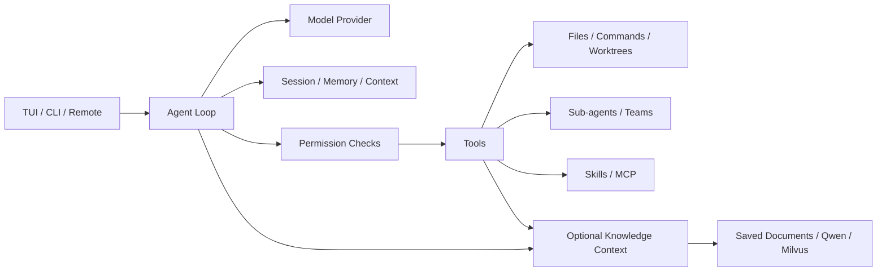

# CodePlus

[中文](README.md) | [English](README_EN.md)

> Tools are bridges across technical gaps, helping us go faster and further. But every bridge has design limits. We should become not only skilled at crossing bridges, but engineers who understand the principles, weigh the tradeoffs, and can build bridges themselves.

CodePlus is a terminal AI coding tool and my exploration of an Agent Runtime: bringing model reasoning into a real environment, with execution rules for tool calls, context, and collaboration that can be inspected.

## Why CodePlus Exists

What first drew me to AI coding tools was their ability to keep working toward a goal: read code, call a tool, observe the result, and decide what to do next. Following that path made me curious about the problems hidden beneath a smooth interaction.

When the model believes an edit is complete, does the workspace match its understanding? If a tool call is interrupted, could retrying repeat a side effect? After context compaction, does the summary still support the decisions made earlier? These questions led me toward the runtime between the model and its environment.

The model may propose a different course of action on every turn, while files, permissions, and execution results need concrete evidence. Through CodePlus, I want to explore how those two meet: leaving room for the model to investigate while tracking what informed an action, what it changed, and what remains uncertain.

## Preserving Causality in the Agent Loop

With **Tool Calling**, model output begins to produce real side effects. A tool name, a streamed argument fragment, and a complete call occupy different lifecycle stages. The [Agent Loop](codeplus/agent.py) collects the full model response before executing tools, keeping partial responses from changing the workspace.

Concurrency adds another constraint. If the model requests an edit followed by a read in the same turn, the read depends on the write. Sending every call to `asyncio.gather` could return an observation of the old file. The current implementation batches only adjacent reads explicitly marked safe for concurrency, preserving the order around writes, commands, and permission waits. Reducing latency has to preserve the causal relationships between these actions.

An interruption can leave a harder state: a file may have changed before its result reached the context. Explicit rejection, execution failure, and an unknown outcome need distinct meanings. The current [tool-use / tool-result pairing repair](codeplus/conversation_pairing.py) inserts an interruption marker before a request, preserves uncertainty about side effects, and leaves the original history intact. Whether a subprocess is still running or an action can be retried safely requires checks at the relevant execution boundary.

This also changes how I think about permissions. **Human-in-the-loop (HITL)** has to connect authorization, waiting, and continued execution within the same tool-call path. Permission propagation through sub-agents, MCP, and different interfaces also needs explicit examination. The model proposes an action, the runtime governs its execution, and the user can pause, redirect, or take over at meaningful points.

## Context Engineering: What Does the Agent Still Know?

Long tasks make **Context Engineering** a question about decisions. The task information directly available for the model's next action depends on what actually enters its context window. A constraint may survive in a log yet stop influencing the model after compaction. Summaries are lossy representations; omitted assumptions or compressed accounts of failed attempts can change the direction of subsequent reasoning.

Current [context management](codeplus/context/manager.py) summarizes older history, retains recent messages verbatim, and keeps tool calls paired with their results. Compaction boundaries are also persisted in the Session for replay. Token budgeting combines API usage with estimates of new messages, resetting the usage anchor after history is rebuilt. These mechanisms address protocol integrity, state recovery, and window limits; whether a summary preserves the constraints needed to finish the task still needs behavioral verification.

Tool definitions consume context too. As MCP tools accumulate, the cost of full **Schemas**, extra discovery turns, and **Prompt Caching** requirements for stable request prefixes all influence the design. CodePlus's [MCP loading strategy](codeplus/mcp/loading_strategy.py) selects eager loading, native deferred loading, or a shared dispatch entry based on tool volume and endpoint. I want to understand whether the input savings justify another discovery step, and whether the model can still find and invoke the right tool.

## Multiple Agents: What Should Be Shared or Isolated?

Delegating work introduces both context isolation and information exchange. Inheriting the parent conversation reduces handoff loss, but may also carry unverified assumptions into a review. A fresh context allows another assessment while requiring the relevant evidence to be supplied again. I want task boundaries to specify goals, input evidence, and acceptance criteria so that delegation can support meaningful cross-checks.

The workspace has concurrency problems of its own. Two Agents with separate contexts may still edit the same file. Git worktrees isolate changes, but integration can expose semantic conflicts: patches may merge cleanly while their assumptions remain incompatible. Current file tools check whether a file has changed since it was read; this modification-time check still leaves a race between checking and writing.

CodePlus currently provides sub-agents, Team Mailboxes, and shared task boards for collaboration within a session. Longer-lived collaboration requires separate handling of message delivery, task ownership, execution, and result acknowledgement. After a successful send, the receiver starting work, completing a side effect, and having its result accepted each need their own state evidence. This is why independent persistent tasks remain future work.

## RAG: Can the Evidence Behind an Answer Stay Consistent?

With **RAG (Retrieval-Augmented Generation)**, I began asking where evidence comes from and which version it belongs to. Chunking determines retrieval units, embeddings define the similarity space, and citations still need to lead back to source locations. CodePlus retains originals, content hashes, document generations, and source spans to preserve **Provenance**. Conversation memory and document evidence are managed separately, keeping an earlier answer from becoming evidence for the next one.

Document updates expose an engineering boundary between SQLite metadata and Milvus vectors: one local transaction cannot commit both stores. The [knowledge service](codeplus/knowledge/service.py) registers a pending operation, updates and verifies the vectors, then commits the metadata. On failure, it blocks further retrieval and retains the prepared material for explicit retry. This recovery path makes partial failure visible and preserves the information needed to continue.

New searches use the current generation; historical citations can still open older source text. Answers also check the corpus revision and require regeneration if it changes. That provides change detection; a consistent snapshot across multiple queries requires more. Citation checks currently establish that a source exists and was provided in the current turn. Whether it supports the conclusion is a further question of **Grounding**.

## How Do We Know an Improvement Works?

These tradeoffs eventually lead to **Evaluation**. I first ask whether the test's oracle is independent of the Agent's account: execution order needs observable reads and writes, interruption recovery needs actual state checks, and compaction needs verification that key constraints still influence later behavior. Failure cases matter because an automated system often has to continue with partially completed work.

The [frozen retrieval experiments](codeplus/knowledge/evaluate.py) distinguish two metrics: **ANN Recall** measures neighbor overlap between approximate and exact retrieval; **evidence recall** measures coverage of annotated source passages. High ANN recall can coexist with poor evidence recall. Failed requests remain in the overall evidence-recall denominator, and empty results are counted separately from request failures. Answer faithfulness still needs its own assessment. These distinctions help identify whether a change improves indexing, retrieval, or the final answer.

## What Works Today

The repository connects model inference, tool execution, context management, and document retrieval. The table lists existing entry points and capabilities.

| Area | Current capabilities |
| --- | --- |
| Execution | Agent Loop, file operations and search, and command execution; TUI, non-interactive CLI, NDJSON events, and browser Remote |
| Collaboration | In-session sub-agents, Team messaging, shared task boards, and background task inspection and cancellation |
| Context | Session persistence and recovery, automatic Memory, Context Compaction, file history, and rewind |
| Knowledge | Import Markdown, text PDFs, and DOCX; answer from documents, save cited reports, inspect sources, update or remove documents, and retry failed operations |
| Extensions | Anthropic, OpenAI, and OpenAI-compatible protocols; Skills, MCP, and Hooks |
| Execution controls | Permission rules, path boundaries, optional OS sandboxing, and Git worktree isolation |

Knowledge mode is available through the TUI, non-interactive CLI, and Remote. Retrieval uses local Qwen embeddings and Milvus; answers use the configured model service. Daily retrieval is vector-based. BM25/RRF are separate experiments; OCR and reranking are not implemented.

## What I Want to Explore Next

The next direction is Durable Execution for independent tasks: continuing from persistent state after process exit, message redelivery, or human intervention. This requires clear boundaries for a single active executor, message acknowledgement, and idempotency. Recovery also needs to establish which side effects already occurred before deciding which actions can be replayed.

These remain design questions and future goals. The repository has no independent Runtime Task or `codeplus task ...` entry point. Session recovery and Team communication each address part of that work.

## Architecture


```mermaid
flowchart LR
    Entry[TUI / CLI / Remote] --> Agent[Agent Loop]
    Agent --> Model[Model Provider]
    Agent --> Context[Session / Memory / Context]
    Agent --> Permission[Permission Checks]
    Permission --> Tools[Tools]
    Tools --> Local[Files / Commands / Worktrees]
    Tools --> Workers[Sub-agents / Teams]
    Tools --> Extension[Skills / MCP]
    Agent --> Knowledge[Optional Knowledge Context]
    Tools --> Knowledge
    Knowledge --> Sources[Saved Documents / Qwen / Milvus]
```

The diagram groups responsibilities. The Agent Loop coordinates models and tools; permissions constrain execution; Session, Memory, and Context manage information with different lifetimes. Knowledge integrates through retrieval tools and evidence for the current turn. These components need to exchange verifiable results and explicit failure states. See the [knowledge architecture](docs/knowledge-architecture.md) for details.

## Quick Start

Requires Python 3.11+, [uv](https://docs.astral.sh/uv/), and a working model API. From the repository, install dependencies and copy the example configuration on first use. Skip the copy if you already have a configuration.

```powershell
uv sync --locked
Copy-Item .codeplus/config.yaml.example .codeplus/config.yaml
```

On Linux/macOS, replace `Copy-Item` with `cp`. Edit `providers` in `.codeplus/config.yaml` with your protocol, endpoint, model, and API key. Set `mcp_servers` to `[]` if you do not use MCP.

```powershell
uv run codeplus
```

Describe your task in the terminal. Use `/help` to see commands, `/session list` and `/session resume <id>` to restore history, and `/tasks` to inspect background sub-agents.

For one-shot execution, NDJSON output, or the browser interface:

```powershell
uv run codeplus -p "Inspect this project and summarize its risks"
uv run codeplus -p "Inspect this project" --output-format stream-json
uv run codeplus --remote
```

Remote listens on `0.0.0.0:18888` by default; open `http://localhost:18888` locally. The TUI applies permission rules to changes and commands requiring confirmation; ordinary `-p` runs automatically approve permission requests.

### Optional: Local Knowledge Base

Start Milvus using the [setup steps](docs/knowledge-setup.md#最短使用流程). Keep `providers` in your existing `.codeplus/config.yaml`, set `knowledge.enabled` to `true`, and check that `knowledge.milvus_uri` points to your service.

```powershell
uv sync --locked --extra knowledge
uv run --extra knowledge codeplus
```

Keep `--extra knowledge` on subsequent runs. The first import or search downloads the local embedding model; answers still use your configured model service.

```text
/knowledge create "Personal documents"
/knowledge import "C:\Documents\reference material"
Compare the options using the documents, cite the sources, and save a report as comparison.md.
/knowledge open K:<kb_id>:<chunk_id>
```

`create` selects the new base; use `/knowledge use <kb_id>` next time. Importing the same path again updates it. Use `/knowledge sources` to list documents, `/knowledge status` to inspect state, and `/knowledge off` to leave knowledge mode. Report writes follow the existing file permissions.

For non-interactive questions, use `uv run --extra knowledge codeplus -p "Answer from the documents with citations" --knowledge <kb_id>`. Non-interactive knowledge mode denies operations requiring approval; explicitly add `--mode acceptEdits` to allow report writes. Remote accepts the same commands, with import paths on the server. See the [full guide](docs/knowledge-setup.md) for removal, recovery, format limits, and retrieval experiments.

## Development

Follow a tool call through the [Agent Loop](codeplus/agent.py) and [tools](codeplus/tools), then trace context and messages through [agents](codeplus/agents) and [teams](codeplus/teams). [memory](codeplus/memory), [context](codeplus/context), and [knowledge](codeplus/knowledge) handle long-term memory, the current reasoning window, and external evidence respectively.

```powershell
uv sync --locked --dev
uv run pytest
```

Real knowledge integration checks also require the optional dependencies, Milvus, and the local model. Setup and acceptance records are in the [knowledge guide](docs/knowledge-setup.md).

## A Continuing Practice

With each new layer of automation, I want to ask what a successful run depends on, what state a failure leaves behind, and whether recovery can continue from actual evidence. CodePlus will keep recording those questions and testing each implementation against real work.
