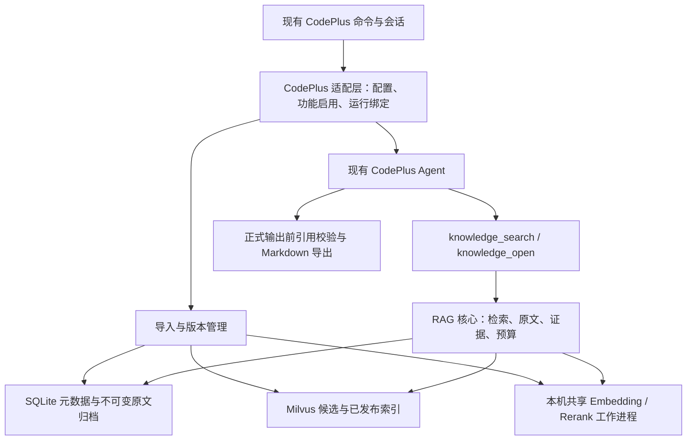

# 架构与接口契约草案

更新日期：2026-09-21。状态：供审阅的技术设计，尚未实现或实测。

本文件把 [主规划 D01–D56](plan.md) 转成可实施的边界、对象和协议。下文 T01–T09 是工程方案，不冒充新增的用户确认；试验参数不是发布承诺。模型与依赖能力验证、验收和任务拆分见 [验收与实施计划](acceptance-and-implementation.md)。

## 1. 模块边界与使用流程

### T01：同进程核心，复用宿主 Agent



建议目录如下，实施时按需要创建，当前不生成空代码：

| 模块 | 责任与依赖 |
| --- | --- |
| `src/agentic_rag/domain/` | ID、不可变配置、请求/响应、状态与错误；不导入 CodePlus、Milvus 或模型框架 |
| `src/agentic_rag/ingestion/` | 输入快照、解析分块、候选构建、发布与恢复 |
| `src/agentic_rag/retrieval/` | Dense/BM25、RRF、Rerank、Context 选择；不自行调用聊天模型 |
| `src/agentic_rag/evidence/` | 来源读取、证据登记、分页、引用校验与历史回看 |
| `src/agentic_rag/storage/` | SQLite、归档文件及 Milvus 的具体实现；只管理本模块资源 |
| `src/agentic_rag/models/` | Embedding/Rerank 能力接口、工作进程客户端及本地实现 |
| `src/agentic_rag/adapters/codeplus/` | 命令/配置转换、工具注册、Agent 运行策略与会话记录 |

核心只接收显式配置和接口，适配层单向依赖核心。采用少量构造函数与类型协议，不建设通用插件平台。独立开发阶段可安装此目录中的开发包，由小范围宿主接点调用；最终迁移为 CodePlus 发行包内的一套实现，业务逻辑不复制两份。

用户流程：选择一个库 → 使用知识库问答或要求报告 → 确定本次类型与检索模式 → 固定库版本和预算 → Agent 搜索、查看结果、按需补查或打开原文 → 整理并校验引用 → 返回答案或 Markdown 报告。预算停止时返回已支持部分、缺口与停止原因。明确“继续研究”才开启关联的新运行，沿用目标与缺口，在当前版本重新取证。

选择知识库与是否使用知识库功能是两件事。适配层为当前任务解析 `feature=knowledge`、`task_kind=qa|report`；一旦功能启用便提供取证工具和规则。管理库、澄清问题、取消任务不冒充资料回答；普通编程和聊天保持原路径。选择模式不复用宿主的权限 `--mode`。

语料、引用和工具返回正文都是待分析的资料，不是用户指令。工具消息标清数据边界；原文中的提示不能扩大工具权限、改变库范围或触发任意命令/外部访问。source URL 作为元数据保存，不因文档包含链接就自动联网抓取。

## 2. 身份、存储与关键对象

### T02：SQLite 为元数据权威，归档与索引分离

默认数据目录建议遵循用户级应用数据目录，允许 `knowledge.data_dir` 覆盖；Windows 使用 LocalAppData 下的 CodePlus 目录，Linux 使用 XDG data 目录或其标准回退。实际路径由宿主适配层解析，核心接收绝对路径。运行数据不放在源码、安装包或当前工作目录中。

```text
<data_dir>/
  catalog.sqlite          所有本地库的元数据、发布指针、运行与恢复记录
  archives/<hash>/         不可变原件、解析文本与定位映射
  derived/<hash>/          可重建的编码结果等缓存，独立于永久归档
  staging/<batch_id>/      未完成临时产物与快照采集文件
  locks/                  本机跨进程锁
  runs/<run_id>/           运行事件及报告产物，真实凭据不写入
```

SQLite 建议启用外键和 WAL，用短事务登记运行、检查占用与发布；解析、推理和建索引在事务外执行。同一个元数据文件只供同机访问，不支持多个主机通过网络共享目录写库。WAL 支持读写并行，但仍只有一个写者；因此需要短事务及有界的 busy 重试。[SQLite WAL](https://www.sqlite.org/wal.html)

| 对象 / 建议表 | 最少字段及不变量 |
| --- | --- |
| `KnowledgeBase / libraries` | `kb_id, name, current_revision_id, pending_mutation_id`；库名不是身份 |
| `Document / documents` | `document_id, kb_id, source_key, original_name`；同库规范化路径关联身份，历史路径另留记录 |
| `DocumentVersion / document_versions` | `document_version_id, document_id, raw_hash, parsed_hash, source_map_hash, parser_fingerprint, source_uri, captured_at, source_metadata`；保存当时文件名/标题/来源等元数据；不可变；相同原件可共享归档，不能合并不同文档身份 |
| `Section / sections` | `section_id, document_version_id, heading_path, start, end`；无标题文档有根章节 |
| `Chunk / chunks` | `chunk_id, document_version_id, section_id, spans, text_hash, chunker_fingerprint`；证据片段与索引输入可分别存储 |
| `ProcessingSnapshot / processing_snapshots` | 解析器、分块、tokenizer、实际模型 revision、模板、向量维度/归一化及索引配置；存完整已解析配置与指纹，不只存 profile 名，不存密钥 |
| `KnowledgeRevision / revisions` | `revision_id, kb_id, base_revision_id, manifest_hash, processing_snapshot_id, index_state`；发布成员清单不可变 |
| `RevisionMember / revision_members` | `revision_id, document_id, document_version_id, chunk_set_hash`；精确描述该版可见资料，删除只影响新清单 |
| `IndexArtifact / index_artifacts` | `artifact_id, revision_id, collection_name, schema_hash, owner_epoch, state`；独立记录准备、可用、回收中、已回收 |
| `ImportBatch / mutation_batches` | `batch_id, kb_id, base_revision_id, input_manifest_hash, processing_snapshot_id, owner_epoch, state, published_revision_id`；所有修改共用库级占用协议 |
| `ImportItem / import_items` | `batch_id, document_id, captured_hash, stage, output_hashes, error`；记录每个文件的完整检查点 |
| `Run / runs` | `run_id, parent_run_id, kb_id, revision_id, task_kind, mode, resolved_config_hash, budget, usage, status, stop_reason`；开始后不漂移 |
| `RunPin / run_pins` | `run_id, revision_id, owner_nonce, state`；保护完整检索索引，不只保护已命中 Chunk |
| `Evidence / evidence` | `evidence_id, run_id, delivery_id, source_ref, spans, text_hash`；仅成功且实际送达 Agent 的正文获得资格 |
| `Citation / citations` | `citation_id, run_id, evidence_id, spans, quote_hash`；对应原件与版本的稳定定位；回看不依赖 Milvus |
| `ResearchContinuation` | 父运行、原目标、已覆盖问题、发现线索、待查问题、停止原因；不保存隐藏推理，不继承证据资格 |

外部身份建议 UUID；内容与配置指纹使用版本化规范 JSON / 字节流的 SHA-256。不能用文本内容哈希代替文档身份。路径身份保存规范化规则版本：绝对路径及分隔符规范化，大小写按目标文件系统规则处理；不因解析符号链接就悄悄合并不同导入路径，冲突显式报错。跨机器移动数据保持已有 ID，不从目标路径重新生成。

归档先写同卷临时文件、校验哈希并完成持久化，再原子改名；随后短事务引用已完成对象。异常可留下未被引用的候选对象，但不能让元数据指向半文件。已登记历史原件与定位归档不自动清理；只有确认无依赖的临时片段和派生产物允许回收。

## 3. 发布、恢复与并发

### T03：一个发布版本对应一个不可变 Milvus Collection

候选 Collection 包含该库版本的完整可见 Chunk，Dense 字段和原生 BM25 字段同属一个 Collection。兼容的未变 Chunk 复用已校验向量，BM25 按该版完整语料重建；不把“增量检测”误写成只索引变化文件。初版优先保证版本正确性，代价是发布时复制未变索引数据、构建耗时和临时空间增加，须在 G0/P3 测量。

选择依据：Milvus BM25 使用 Collection 的统计信息；仅给共享 Collection 加 `revision_id` 过滤，不能据此认定旧版 BM25 统计也固定。本方案通过物理隔离各版避免此问题，属于工程推导，仍需真实测试。原生 BM25 的文本分析器、稀疏字段及 Function 以锁定版本的实际能力为准。[Milvus Full Text Search](https://milvus.io/docs/full-text-search.md)

Collection 命名带安装命名空间、库、候选版本及构建代次的不可混淆标识。SQLite 保存精确名称，不依赖检索时会移动的别名。发布后不再插入、删除或改写该 Collection 的内容；旧任务的 Dense、BM25、RRF 和原文读取均由固定 revision 解析。

发布步骤：

1. 获得该库 OS 级修改锁；短事务检查没有其他待处理修改，登记批次、基准版本与 `owner_epoch`。
2. 固定文件清单，逐文件采集完整原件快照和哈希；后续解析只读快照。捕获前后状态异常或原件不完整时明确失败，不悄悄换成续跑时的新文件。
3. 按批次固定的处理配置处理全部文件；完整成功的新文档加入候选，失败更新保留旧版本，失败新增不加入。已完成检查点记录产物哈希。
4. 全部文件处理结束后生成完整候选成员清单。没有成功变更时结束为 `COMPLETED_NO_CHANGE`，不创建新发布版。
5. 完成候选索引的写入、构建和加载；校验身份集合、条数、向量维度、配置指纹及真实 Dense/BM25 查询可用。索引查询建议显式使用 Strong 一致性，不能把默认有界延迟当作写后立即可见的保证；Strong 也不能代替版本协议。[Milvus Consistency](https://milvus.io/docs/consistency.md)
6. 用一个 SQLite 短事务检查 `base_revision_id` 仍是当前版、拥有者及代次有效、候选已验证，然后写发布记录、切换当前指针并结束批次。旧索引不在此事务中删除。
7. 提交后新运行可绑定新版；旧运行继续旧版。提交响应丢失时先读发布记录，不能重复发布或声称失败后又覆盖新指针。

这是“先准备不可变资源，再提交权威指针”的协议，不是文件、SQLite 与 Milvus 的分布式事务。提交后服务临时不可达应返回明确故障，不自动切回另一个版本。

| 批次状态 | 转换规则 |
| --- | --- |
| `SNAPSHOTTING → PROCESSING → INDEXING → VALIDATING → READY` | 每一阶段有可核验的输入、配置与产物；文件级失败单独记录 |
| `READY → PUBLISHED` | 只有上述发布事务可生效；普通导入可带失败文件清单，模型兼容性重建必须覆盖全部当前成员 |
| 任意未发布阶段 → `WAITING_RECOVERY` | 中断后记录或恢复检查识别；不自动续跑，不提前发布 |
| `WAITING_RECOVERY → 原有效阶段` | 用户继续；重新取得修改权、增加代次、核对输入和配置，复用有效产物 |
| 未发布且停止执行 → `ABANDONED` | 用户放弃；先隔离旧拥有者/迟到结果，再解除待处理限制 |
| 无变化 / 全部文件失败 → `COMPLETED_NO_CHANGE` | 正常批次已结束，汇总失败，不继续阻塞后续修改；仍可显式重试失败项 |

候选索引损坏可从有效检查点重新构建新代次的 Collection，不能让旧异步写入污染新候选。模型工作进程不写 SQLite 或 Milvus；返回值由当前拥有者核验后接纳。继续与放弃争用同一修改锁。不能用删除锁文件、PID 存在或超时心跳单独证明执行权已经安全转移。

Embedding 配置切换按 D16：未确认的目标只记为提议，不启动或长期占有修改锁；确认时重新检查库范围、基准版和目标指纹，变化则重新说明。构建失败等待“重试/保留原版”，期间该库不启动其他修改，查询仍用已发布版。保留原版终止本次意图，记住实际配置及被放弃的目标指纹，避免下一次启动重复提出相同切换。具体交互保持 [模型配置设计](model-providers.md) 的规则。

### T04：运行绑定与索引回收共用元数据协议

运行先取得自己的 OS 生命周期锁，再在短事务中检查当前版索引状态可查询并登记 pin。回收器在相同事务边界检查：不是当前版、没有活跃运行 pin、没有构建/重试/恢复依赖，才把索引标成 `DELETING`；随后删除该模块拥有的物理资源并记录结果。已标记回收的版本不能再绑定新运行。

正常结束释放 pin 与锁；崩溃后的 pin 只有在确认原运行生命周期锁已释放且身份无歧义时才清理。不确定时保留，时间过长本身不是回收许可。候选及基础向量复用也登记依赖，不能只检查问答 pin。物理删除失败保留待清理状态并重试，不影响原文归档及历史引用回看。

## 4. 解析、分块与输入约束

### T05：结构解析与原文位置分别负责

首版支持 UTF-8（含 BOM）Markdown/TXT；不支持的编码给出文件级错误。保留原始字节，另存规范解析文本及从规范文本到原件的映射。证据位置统一为规范文本 Unicode 码点 `[start, end)`，展示行号从 1 开始；不得混用 UTF-8 字节偏移、UTF-16 下标或 token 下标。

Markdown 候选解析器采用 `markdown-it-py` 获取标题、段落、列表、表格、代码块结构，再由自己的映射层维护正文区间。其 `Token.map` 提供行区间，不能直接当作字符偏移；必须校验重复文本、CRLF、Unicode 和嵌套结构。[markdown-it-py Token API](https://markdown-it-py.readthedocs.io/en/latest/api/markdown_it.token.html)

切分按章节 → 结构块 → 带位置的句子边界 → 超长块的 token 边界进行；代码/表格尽量保持结构，拆开时保留位置和未完整结构的标记。句子边界组件必须返回原文本区间，禁止用 `str.find()` 回查重复文本。加入标题路径的检索文本与可引用的原文摘录分字段保存，标题模板不是凭空新增的正文。

试验起点建议 Chunk 512 token、overlap 64 token；最终输入必须按实际 Embedding 模板、特殊 token 和 tokenizer 重算，不使用字符数代替。Rerank 另按自己的 tokenizer、query 与完整模板检查；过长 query 或候选返回 `INPUT_TOO_LONG`，不静默截断后当作全段评分。通过调参解决常见超长问题，变更切分/索引输入时重建对应版本。

`knowledge_open` 的正文来自该版本解析归档，原件另供回看。长章节分页在可追溯的文本边界截取；目录、标题列表和“尚有后文”的提示不算已读正文。Markdown 首版不伪造 PDF 页码。

## 5. 检索、Context 与工具契约

### T06：稳定候选身份贯穿各阶段

Dense 由绑定版本的 Embedding 身份编码 query；BM25 用同一个 query 文本直接检索。Hybrid 两路都完成后以 `chunk_id` 合并，分数为 `Σ 1 / (k + rank)`，rank 从 1 开始，试验起点 `k=60`、等权；同分按稳定 Chunk ID 排序。某一路合法空结果可继续，任一路执行失败则本次 Hybrid 失败。

试验起点为 Dense/BM25 各取 50、RRF 后最多 50 进入 Rerank；Rerank 逐 Chunk 返回完整候选的 ID 与分数，批次任一失败整次失败。禁止用不同 query 或不同模型的原始分数直接比较。原始候选、分支名、排名、融合及精排结果保留在追踪记录，只有最终实际送达的正文成为证据。

每次搜索按当前排序去重重叠片段，保留问题所需的同文档不同证据与冲突材料；同等相关时优先互补来源，不设置来源配额。初始建议最多 8 个 Chunk、证据正文最多 8,000 个宿主模型 token，并取宿主剩余窗口与本次预算的更小值。读取原文也占证据窗口；多次工具调用不能每次重置累计窗口限制。跨搜索轮次采用分批呈现、合并同位置重复片段并记录保留/移出内容，不制造跨 query 的可比分数。

核心先产生待交付片段，适配层完成序列化、最终长度裁剪及实际消息交付后才提交 `delivery_id`。宿主如果压缩、溢出落盘或截短工具输出，必须反馈实际交付区间，不能把模型没有看到的全文记为已读。离线 Context 指标使用实际模型输入快照；历史曾送达的证据资格与当前窗口内容分别记录。

工具字段草案（JSON Schema 由 Pydantic 类型生成）：

| 工具 | Agent 可传入 | 宿主注入，Agent 不可覆盖 |
| --- | --- | --- |
| `knowledge_search` | `query: 非空文本`；auto 时可选 `strategy: dense\|bm25\|hybrid` 和 `rerank: bool`；未指定时使用本次配置的基础路线 | `run_id, kb_id, revision_id, processing/config snapshot, candidate/context limits, deadline` |
| `knowledge_open` | `source_ref`；可选 `section_id` 或 `cursor`，二者互斥 | 本次运行范围、固定版本、阅读 token 上限、截止时间 |

fixed 工具 Schema 不暴露路线和重排覆盖项，服务端仍校验禁止覆盖；auto 也不能设置 `top_k`、模型地址、库 ID 或访问任意本地路径。基础路线建议先以 Hybrid+Rerank 试验，是否成为配置默认值由同条件基线决定，不能预先宣称优于 Dense。

搜索成功响应示意，字段不是当前已提供的 API：

```json
{
  "schema_version": 1,
  "call_id": "call-...",
  "status": "ok",
  "run_id": "run-...",
  "revision_id": "rev-...",
  "route": {"strategy": "hybrid", "rerank": true},
  "items": [{
    "evidence_id": "ev-...",
    "source_ref": "src-...",
    "document_id": "doc-...",
    "document_version_id": "dv-...",
    "file_name": "article.md",
    "section_path": ["Title", "Section"],
    "chunk_id": "chunk-...",
    "spans": [{"start": 120, "end": 147}],
    "text": "A source excerpt goes here."
  }],
  "limited": {"by_count": false, "by_tokens": false},
  "remaining": {"search_calls": 4, "open_calls": 8}
}
```

`status` 为 `ok|empty|error`；失败不附带可当作成功证据的中间候选。原文响应另含 `section_id, returned_spans, next_cursor, has_more`；cursor 为服务端签发的不透明句柄，绑定运行、文档版本、章节与下一位置，跨运行/版本使用拒绝。搜索来源句柄允许沿本版文档导航；历史引用通过用户回看入口读取，不自动取得新运行的证据资格。

错误统一为 `code, stage, message, retryable, call_id`，至少区分 `KB_NOT_READY / KB_BUSY / RECOVERY_REQUIRED / SCOPE_MISMATCH / INVALID_CURSOR / INDEX_UNAVAILABLE / MODEL_UNAVAILABLE / INPUT_TOO_LONG / QUEUE_FULL / DEADLINE_EXCEEDED / BUDGET_EXHAUSTED / CANCELLED / CITATION_INVALID`。`retryable` 是提示，不触发隐藏重试。fixed 可原路线重试或改 query；auto 可显式改路线/重排，每次实际尝试都计入预算。

## 6. 宿主接点、引用与预算

### T07：为知识库运行装配可选执行策略

当前可复用的真实代码基础是 `Tool`、`ToolResult`、`ToolRegistry` 及 `Agent.run()` / `run_to_completion()`。现有 `codeplus/agent.py` 仍有旧 `_prepare_knowledge` 预搜索、知识库专用写入校验和输出 token 上限自动提升路径；不能把它们直接当成新方案已经接入。

建议最小宿主扩展为可选的运行策略，覆盖模型调用前预算检查、工具执行前检查、工具结果实际交付回执、正式输出校验及 `finally` 结束处理。两条 Agent 执行路径共用同一策略；普通任务不装配该策略。工具实例绑定单次运行，避免多会话共享可变的全局知识库范围。保留现有权限检查与通用工具调度，不另写一套 Agent 循环。

知识库任务在未进行本轮有效取证时不能交付声称基于资料的事实答案。没有命中、发生错误或只需要澄清时可以明确返回对应状态；此检查不规定必须把某次搜索强塞为第一条工具调用。Agent 可查看当前能力、做必要查询改写，再调用搜索。

引用使用宿主生成的证据 ID 与稳定引用 ID，Markdown 通过规范脚注引用，展示来源文件、版本、section/Chunk 及原文摘录。验证器解析全部引用，核对本轮成功交付资格、库/版本/位置和直接摘录；精确比较基于已归档原文映射，不能靠当前源文件或仅用字符串“看起来相似”。事实支持、信息覆盖和推断合理性在离线评测检查。

正式答案正文先缓冲，校验通过后交付或保存。失败时向同一个 Agent 提供定位明确的错误，在剩余预算内至多修正一次并完整重校；不能仅删掉失效引用后发布原结论。仍失败则返回 `incomplete`、原因和已确认可用证据。流式状态可以展示检索进度，不把待校验正文当正式报告。报告落盘在校验后执行，继续遵循宿主文件权限、路径与覆盖规则；保存失败不声称已生成文件。

| 预算维度 | 计量与停止规则 |
| --- | --- |
| 搜索 / 打开原文次数 | 按已受理的尝试计数，失败和重试不免费；同时记录拒绝调用，防止参数错误循环；宿主迭代上限仍有效 |
| LLM token | 累计实际模型输入/输出，包含改写、重试、继续研究线索和引用修正；缓存 token 单列，按提供方定义归一化避免重复相加；缺失用量标未知而非零 |
| 上下文窗口 | 按本次发送的完整消息、工具定义和证据计算；与累计用量预算分开；预留回答输出空间 |
| 时间 | 从运行开始的单调时钟计算，含加载、排队、工具与最终输出；不是每次调用重新计时 |
| 收尾预留 | 搜索/阅读只可消费探索额度；到探索上限停止取证，使用预留完成总结和校验；最终硬上限到达后只返回已验证内容及停止状态 |

预算由 `task_kind` 选择 QA/报告配置，与 fixed/auto 正交，单次覆盖在运行开始时冻结。模型调用前保守估计输入并限制可用输出；提供方统计与本地估计都记录，未知 token 行为进入 G0 校准。仅知识库运行禁止宿主自动增大模型输出上限绕过配置；普通任务行为保持不变。

`Run.status` 建议为 `running|completed|partial|incomplete|failed|cancelled`；`stop_reason` 单独区分完成、无可用资料、预算、依赖错误、引用错误和用户取消。`completed` 不宣称语义必然正确。预算具体数值在基线后冻结，不在本文件随意承诺时延。

继续研究的新运行保存 `parent_run_id`，把旧目标、发现与缺口作为待验证线索注入；不复制旧 `evidence` 登记。即使版本未变也需本轮工具重新返回正文才可引用。新版已删除的来源不从旧档案偷偷补回检索范围；可以说明历史发现未能在当前资料核实。保留逐轮与累计成本，旧报告不被覆写。

## 7. 模型提供方与本机工作进程

### T08：固定协议和模型身份，小范围共享推理

能力接口建议：`embed_documents(items, resolved_profile, request_context)`、`embed_query(query, ...)`、`rerank(query, candidates, ...)`，响应带请求/候选 ID、实际模型指纹、结果与计量。`resolved_profile` 至少包含模型 revision、tokenizer、输入模板、维度/归一化、dtype、推理实现和设备；不同语义身份不能共用编码缓存或被误认成同一个驻留实例。

本地首测候选沿用 [Qwen3-Embedding-0.6B](https://huggingface.co/Qwen/Qwen3-Embedding-0.6B) 和 [Qwen3-Reranker-0.6B](https://huggingface.co/Qwen/Qwen3-Reranker-0.6B)，按官方输入及评分约定实现。采用与否、精确 revision、依赖和显存能力由 G0 实测冻结；模型卡不证明两个模型在当前 GPU 能同时稳定驻留。

首版 IPC 建议用仅绑定 loopback 的 TCP 与长度受限 JSON 消息，随机认证令牌保存于当前 OS 用户私有运行目录；请求不携带可执行代码。握手包含协议版本、工作进程实例 ID、运行时兼容指纹和设备。启动锁按 OS 用户、设备及运行时兼容域管理，两客户端竞争启动只能复用同一可用实例；不兼容时明确诊断，不静默争抢同一设备再开一份模型。

请求含 `request_id, owner_id, capability, profile_fingerprint, purpose, deadline, items`；响应含 ID 对齐结果、加载/排队/推理时间及错误。工作进程只推理，不能发布库版本或改报告。相同实际配置复用实例，不同配置可卸载/重载，是否同时驻留由容量策略决定；不能因缓存淘汰而删掉恢复仍需的模型文件。

调度先采用单 GPU 串行有限批次，前台同级 FIFO；有后台工作时，每完成至多 4 个前台批次让后台执行 1 个有界批次，作为试验起点。G0 根据前台等待和后台吞吐调整配额及 batch token 上限。模型加载、切换及排队都计入截止时间；不承诺抢占已运行的 GPU 内核。队列有界，满时显式失败。

取消等待请求立即出队；已经运行的批次可到边界结束，但过期/取消结果不能回写为成功。客户端退出只取消其请求，其他客户端继续；无客户、无在途请求后按可配置闲置期退出。通信断开、工作进程死亡和 OOM 返回失败，按 D25/D16 由上层决定重试；不自动切 CPU、外部 API 或另一模型。

配置继续使用 [模型配置设计](model-providers.md) 的 `knowledge.models` / `model_profiles` 域；新增 `knowledge.retrieval`、`knowledge.budgets.qa/report`、`knowledge.storage` 等子域。所有字段通过一个配置 Schema 校验，存储快照与来源优先级；未实现的 API provider 不出现在“可用能力”中。

## 8. 命令、打包与迁移

### T09：沿用基础命令，分阶段接入同一实现

`/knowledge create/use/import/status/sources/reimport/remove/retry/off/open` 等已有基础形式由新处理器承接；补充恢复/放弃及本次模式选择时扩展该命令帮助，不建设另一套产品 CLI。`codeplus -p` 仍走真实 Agent；无交互运行遇到重建确认，缺少明确授权参数则返回待确认，不能默认同意。具体新增参数在 P6 同步帮助、调用方和测试，尚不能直接使用本草案命令。

独立阶段在本目录声明自己的包和正式测试，开发宿主仅添加装配所需接点；迁移阶段将核心、适配层和资源纳入 CodePlus 同一发行包并移除开发依赖，保持新模块生成的库 ID、归档和引用有效。模型权重和用户数据不打入 wheel；本地模型依赖保持可选，普通安装不加载 GPU 模块。

当前根 wheel 仅包含 `codeplus`，部署资源映射仍指向不存在的旧路径，必须明确修正打包清单并检查实际 wheel/sdist；目录移动不能自动完成这些工作。构建配置以 [Hatch 官方说明](https://hatch.pypa.io/latest/config/build/) 为依据，真实安装验证列入 P7/P8。

备份方案先采用停止修改并等待在途任务结束后导出一致的 SQLite 备份与全部被引用归档，保存模型/索引清单；索引可单独迁移或按固定配置重建。恢复在新目录先校验哈希、引用及索引可用后启用，禁止覆盖正在使用的数据目录。首版不提供跨主机同时写入共享数据的承诺。

## 9. 实测前不能声称已解决的事项

G0 必须验证 Milvus 客户端/服务端与原生 BM25 组合、物理版本隔离、两模型在目标设备的运行与调度、原文映射和两种宿主执行路径的实际接点。P7 再完成 Windows/Linux 安装、全链路与质量验收。D56 已明确预算内质量优先，质量/时延目标据此用冻结基线给出数值；实际未达标时缩小受支持参数或修正方案，不能静默更换用户已确认的功能边界。

文档中的接口和协议可以进入实施任务审阅，但“方案已写清”“功能已实现”“真实环境已通过”分别记录。
